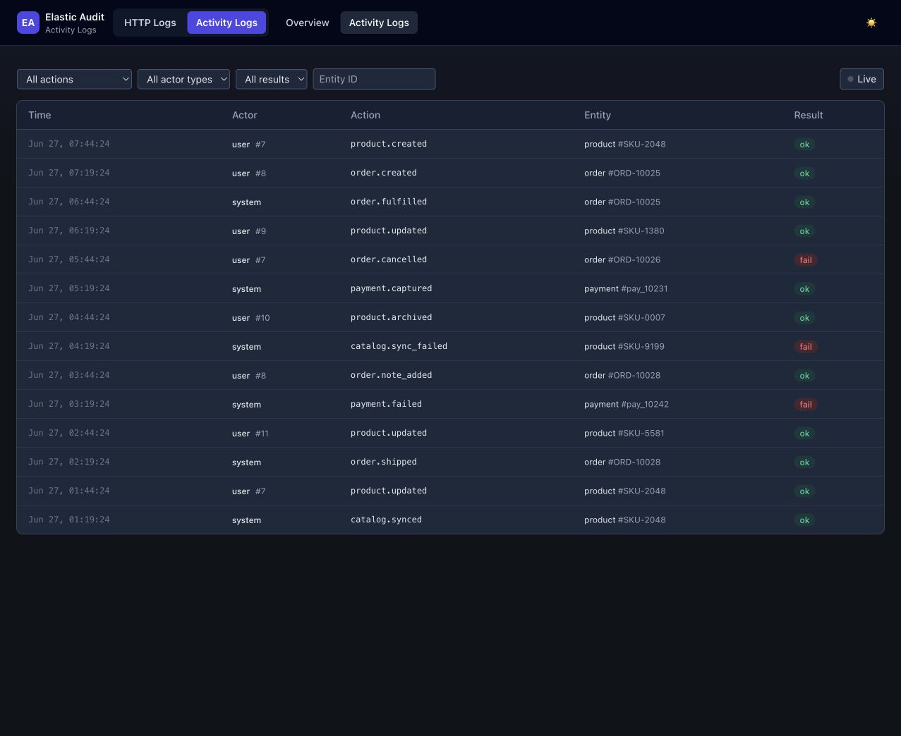

# Activity Logs

[Back to Elastic Audit](README.md) · [Audit Logs](AUDIT_LOGS.md)




## Overview

An independent subsystem for recording **what actors did or changed** — user actions and Eloquent model
changes — indexed to a dedicated Elasticsearch index. It is fully decoupled from the HTTP logger: the two share
only the Elasticsearch client and the service provider. Each has its own config, index/aliases, DTOs, job,
indexer, commands, and dashboard.

### How It Works

The capture → queue → index pipeline mirrors the HTTP logger:

```text
ActivityLogger::record()  →  ActivityLogData (immutable DTO)  →  LogActivityJob (queued)
    →  ActivityLogIndexer  →  LogElasticsearchClientInterface  →  activity write alias
```

Capture never throws and is gated by `activity_logs.enabled`. Indexing happens asynchronously on the
configured queue. The document ID is `sha256(eventId)`.

### Activity Configuration

Published alongside the other configs under the `elastic-audit` tag:

```bash
php artisan vendor:publish --tag=elastic-audit
```

`config/activity_logs.php`:

```php
return [
    'enabled'           => env('ACTIVITY_LOGS_ENABLED', true),
    'queue'             => env('ACTIVITY_LOGS_QUEUE', 'default'),
    'retention_days'    => 360,

    'index_alias'       => strtolower(env('LOG_ELASTICSEARCH_INDEX_PREFIX', env('APP_NAME'))) . '_activity_logs',
    'index_alias_write' => strtolower(env('LOG_ELASTICSEARCH_INDEX_PREFIX', env('APP_NAME'))) . '_activity_logs_write',

    // Redaction applied to the 'changes' and 'metadata' maps before queueing.
    'redaction' => [
        'block' => [],
        'allow' => [],
    ],

    'dashboard' => [
        'enabled'    => env('ACTIVITY_LOGS_DASHBOARD_ENABLED', true),
        'prefix'     => env('ELASTIC_AUDIT_DASHBOARD_PREFIX', 'logger'),
        'path'       => env('ACTIVITY_LOGS_DASHBOARD_PATH', 'activity'),
        'middleware' => ['web'],
        'per_page'   => 25,
    ],
];
```

It reuses the existing `log_elasticsearch.php` connection — activity logs are never written to the
product-search cluster.

The `changes` and `metadata` maps are redacted by key name before queueing, using the same rules as the HTTP logger
(so a model's `password` / `email` attribute diffs never reach Elasticsearch in clear text). Tune it with
`activity_logs.redaction.block` / `.allow` — same semantics as the HTTP [Redaction Notes](AUDIT_LOGS.md#redaction-notes), but a
single flat list since activity events have no headers.

Relevant environment variables:

| Variable                          | Default    | Purpose                                                                                           |
|-----------------------------------|------------|---------------------------------------------------------------------------------------------------|
| `ACTIVITY_LOGS_ENABLED`           | `true`     | Master on/off switch for capture                                                                  |
| `ACTIVITY_LOGS_QUEUE`             | `default`  | Queue the indexing job is dispatched to                                                           |
| `ACTIVITY_LOGS_DASHBOARD_ENABLED` | `true`     | Register the dashboard routes                                                                     |
| `ELASTIC_AUDIT_DASHBOARD_PREFIX`  | `logger`   | Shared URL prefix for both dashboards. Composes as `{prefix}/{path}`. Set to `''` for root paths. |
| `ACTIVITY_LOGS_DASHBOARD_PATH`    | `activity` | This dashboard's subpath under the group prefix. Served at `/logger/activity`.                    |

### Create the Activity Index

```bash
php artisan activity-logs:create-index
```

Creates the physical index (`<prefix>_activity_logs_<timestamp>`) with a `dynamic: strict` mapping and
attaches the read/write aliases.

### Manual Logging

Use the `ActivityLog` facade. Build an `ActivityLogContext` describing the actor and entity, then record an
action with an optional field-level diff and metadata.

```php
use Tsitsishvili\ElasticAudit\Facades\ActivityLog;
use Tsitsishvili\ElasticAudit\DataTransferObjects\ActivityLogContext;
use App\Enums\ElasticAudit\EntityType;

// User-driven change with a before/after diff
ActivityLog::record(
    action: 'order.status_updated',
    context: ActivityLogContext::forActor(
        actorType: 'user',
        actorId: $userId,
        entityType: EntityType::Order,
        entityId: (string) $order->id,
        requestId: $request->header('X-Request-ID'), // optional; auto-ULID if omitted
    ),
    changes: [
        'status' => ['old' => 'pending', 'new' => 'paid'],
        'amount' => ['old' => 100,       'new' => 95],
    ],
);

// System/cron action — no actor id, marked as failed
ActivityLog::record(
    action: 'invoice.auto_cancelled',
    context: ActivityLogContext::forActor(
        actorType: 'cron',
        actorId: null,
        entityType: EntityType::Invoice,
        entityId: (string) $invoice->id,
    ),
    metadata: ['reason' => 'payment_timeout'],
    success: false,
    errorClass: TimeoutException::class,
    errorMessage: 'Payment confirmation timed out',
);
```

`entityType` accepts any `EntityTypeContract` (typically a backed enum published into your app).
`actorType` is a free string — conventionally `user`, `system`, `cron`, or `job`. `retentionDays` defaults to
`360` and can be overridden per call via `ActivityLogContext::forActor(..., retentionDays: 90)`.

### Automatic Model Logging (the `ActivityLoggable` trait)

Add the trait to an Eloquent model to log `created` / `updated` / `deleted` automatically with a computed diff:

```php
use Illuminate\Database\Eloquent\Model;
use Tsitsishvili\ElasticAudit\Traits\ActivityLoggable;

class Order extends Model
{
    use ActivityLoggable;

    // Optional — defaults to Str::snake(class_basename($model)), e.g. "order"
    protected string $activityEntityType = 'order';

    // Optional — fields excluded from the diff.
    // Defaults to ['created_at', 'updated_at', 'deleted_at'] when not defined.
    protected array $activityLogExcept = ['updated_at', 'created_at'];

    // Optional — if non-empty, only these fields appear in the diff.
    protected array $activityLogOnly = [];
}
```

| Eloquent event | Action logged      | `changes` content                                            |
|----------------|--------------------|--------------------------------------------------------------|
| `created`      | `{entity}.created` | `{field: {old: null, new: value}}` for all logged attributes |
| `updated`      | `{entity}.updated` | `{field: {old, new}}` for dirty fields only                  |
| `deleted`      | `{entity}.deleted` | `{}` (the entity itself is the event)                        |

`$activityLogOnly` is applied first (whitelist), then `$activityLogExcept` (blacklist). The entity id is
`(string) $model->getKey()`.

### Actor Resolution

The trait resolves the current actor automatically:

1. `Auth::check()` is true → `actorType: "user"`, `actorId: Auth::id()`
2. Otherwise → `actorType: "system"`, `actorId: null`

For manual `ActivityLog::record()` calls you set the actor explicitly via the context.

### Document Shape

```json
{
  "@timestamp": "2026-06-04T10:00:00Z",
  "event_id": "01JX...",
  "schema_version": 1,
  "request_id": "01JX...",
  "actor": {
    "type": "user",
    "id": 42
  },
  "action": "order.status_updated",
  "entity": {
    "type": "order",
    "id": "99"
  },
  "changes": {
    "status": {
      "old": "pending",
      "new": "paid"
    }
  },
  "metadata": {
    "ip": "1.2.3.4"
  },
  "success": true,
  "error": {
    "class": null,
    "message": null
  },
  "retention_days": 360
}
```

`changes` and `metadata` are stored but **not indexed** (`enabled: false`) — their keys are caller-defined, so
they are searchable by `event_id`/`action`/`actor`/`entity` but not by their inner keys.

### Activity Dashboard

When `activity_logs.dashboard.enabled` is true, the dashboard is served under the configured path (default
`/logger/activity`):

- **Overview** — total / success / failure counts, top actions, top actor types.
- **List** — paginated, newest first, filterable by action, actor type, success, entity id, and date range.
- **Detail** — full event, a before/after change table, and a metadata dump.

Access is gated by the same authorization callback as the HTTP dashboard:

```php
use Tsitsishvili\ElasticAudit\Dashboard\Dashboard;

Dashboard::auth(fn ($request) => $request->user()?->can('viewActivityLogs') === true);
```

By default (no callback registered) access is restricted to the `local` environment.

### Pruning Activity Logs

```bash
php artisan activity-logs:prune
```

Deletes documents older than their own `retention_days` value (each document carries its retention, so different
actions can have different lifetimes). Schedule it daily.

### Guarantees

- **Capture never throws.** A logging failure can never break the surrounding request — errors are swallowed and
  the job's own failures are logged, not propagated.
- **Disabled is a true no-op.** With `activity_logs.enabled = false`, `record()` returns immediately and no job
  is dispatched.
- **Backward compatibility.** The indexed document shape is versioned via `ActivityLogData::SCHEMA_VERSION`; the
  mapping is `dynamic: strict`.
