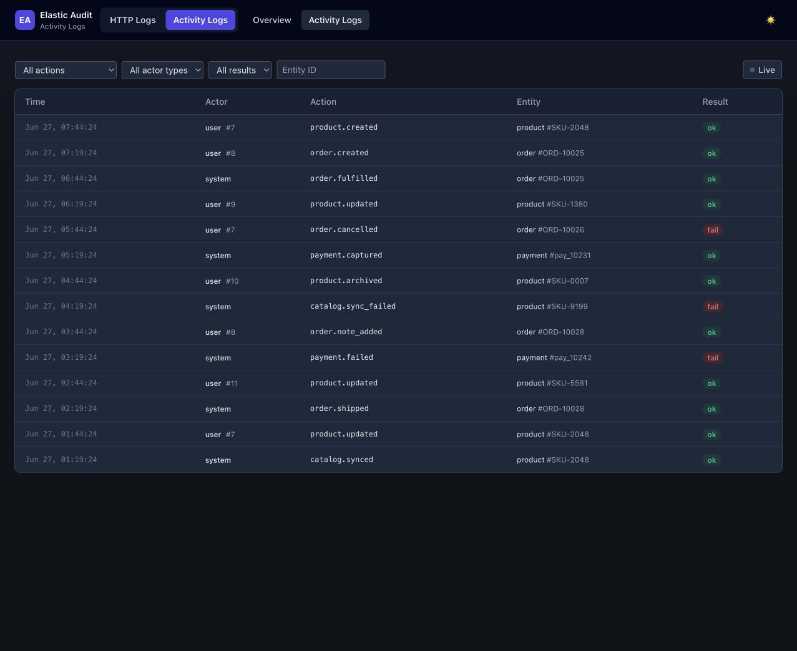

# Activity Logs

[Back to Elastic Audit](README.md) · [Audit Logs](AUDIT_LOGS.md)




This guide is independent from the [Audit Logs](AUDIT_LOGS.md) subsystem and can be enabled on its own.

## Project Documents

- [Agent Guide](AGENTS.md)
- [Changelog](CHANGELOG.md)
- [Upgrade Guide](UPGRADE.md)
- [Contributing](https://github.com/tsitsishvili/elastic-audit/blob/main/CONTRIBUTING.md)
- [Coding Standards](https://github.com/tsitsishvili/elastic-audit/blob/main/CODING_STANDARDS.md)

## Table of Contents

- [Overview](#overview)
- [How It Works](#how-it-works)
- [Activity Configuration](#activity-configuration)
- [Create the Activity Index](#create-the-activity-index)
- [Manual Logging](#manual-logging)
- [Automatic Model Logging (the `ActivityLoggable` trait)](#automatic-model-logging-the-activityloggable-trait)
- [Actor Resolution](#actor-resolution)
- [Document Shape](#document-shape)
- [Activity Dashboard](#activity-dashboard)
- [Pruning Activity Logs](#pruning-activity-logs)
- [Guarantees](#guarantees)

## Overview

An independent subsystem for recording **what actors did or changed** — user actions and Eloquent model
changes — indexed to a dedicated Elasticsearch index. It is fully decoupled from the HTTP logger: the two share
only the Elasticsearch client and the service provider. Each has its own config, index/aliases, DTOs, job,
indexer, commands, and dashboard.

### How It Works

The capture → queue → index pipeline mirrors the HTTP logger:

```text
ActivityLogger::record() 
→ ActivityLogData (immutable DTO) 
→ LogActivityJob (queued)
→ ActivityLogIndexer 
→ LogElasticsearchClientInterface 
→ activity write alias
```

Capture never throws and is gated by `activity_logs.enabled`. Indexing happens asynchronously on the configured queue.
Activity jobs wait for the active database transaction to commit; a rollback discards the queued audit event so the log
cannot claim that an uncommitted model change occurred. The Elasticsearch document ID is the raw `eventId` ULID.

### Activity Configuration

Published alongside the other configs under the `elastic-audit` tag:

```bash
php artisan vendor:publish --tag=elastic-audit
```

`config/activity_logs.php`:

```php
return [
    'enabled'           => env('ACTIVITY_LOGS_ENABLED', true),
    'queue'             => env('ACTIVITY_LOGS_QUEUE', 'default'),
    'job'               => [
        'tries'         => env('ACTIVITY_LOGS_JOB_TRIES', 3),
        'backoff'       => explode(',', (string) env('ACTIVITY_LOGS_JOB_BACKOFF', '10,30,120')),
        'timeout'       => env('ACTIVITY_LOGS_JOB_TIMEOUT', 30),
        'batch_timeout' => env('ACTIVITY_LOGS_BATCH_JOB_TIMEOUT', 60),
    ],
    'retention_days'    => env('ACTIVITY_LOGS_RETENTION_DAYS', 360),
    'retain_forever'    => env('ACTIVITY_LOGS_RETAIN_FOREVER', false),

    // null derives both names from log_elasticsearch.index_prefix
    'index_alias'       => null,
    'index_alias_write' => null,

    // Redaction applied to the 'changes' and 'metadata' maps before queueing.
    'redaction' => [
        'block' => [],
        'allow' => [],
    ],

    'dashboard' => [
        'enabled'    => env('ACTIVITY_LOGS_DASHBOARD_ENABLED', true),
        'prefix'     => env('ELASTIC_AUDIT_DASHBOARD_PREFIX', 'logger'),
        'path'       => env('ACTIVITY_LOGS_DASHBOARD_PATH', 'activity'),
        'middleware' => ['web'],
        'per_page'   => 25,
    ],
];
```

It reuses the existing `log_elasticsearch.php` connection — activity logs are never written to the
product-search cluster.

The `changes` and `metadata` maps are redacted by key name before queueing, using the same rules as the HTTP logger
(so a model's `password` / `email` attribute diffs never reach Elasticsearch in clear text). Tune it with
`activity_logs.redaction.block` / `.allow` — same semantics as the
HTTP [Redaction Notes](AUDIT_LOGS.md#redaction-notes), but a
single flat list since activity events have no headers. Sensitive change fields retain their `{old, new}` structure
with both values redacted, and activity error messages receive the HTTP credential/URL sanitizer plus a 2048-byte cap.

Relevant environment variables:

| Variable                          | Default     | Purpose                                                                                           |
|-----------------------------------|-------------|---------------------------------------------------------------------------------------------------|
| `ACTIVITY_LOGS_ENABLED`           | `true`      | Master on/off switch for capture                                                                  |
| `ACTIVITY_LOGS_QUEUE`             | `default`   | Queue the indexing job is dispatched to                                                           |
| `ACTIVITY_LOGS_JOB_TRIES`         | `3`         | Attempts for each queued activity log job                                                         |
| `ACTIVITY_LOGS_JOB_BACKOFF`       | `10,30,120` | Comma-separated retry backoff seconds for activity log jobs                                       |
| `ACTIVITY_LOGS_JOB_TIMEOUT`       | `30`        | Timeout in seconds for single activity log jobs                                                   |
| `ACTIVITY_LOGS_BATCH_JOB_TIMEOUT` | `60`        | Timeout in seconds for activity bulk replay jobs                                                  |
| `ACTIVITY_LOGS_RETENTION_DAYS`    | `360`       | Default finite retention; must be an integer from `1` through `32767`                             |
| `ACTIVITY_LOGS_RETAIN_FOREVER`    | `false`     | Make permanent retention the default; finite context overrides remain available                  |
| `ACTIVITY_LOGS_DASHBOARD_ENABLED` | `true`      | Register the dashboard routes                                                                     |
| `ELASTIC_AUDIT_DASHBOARD_PREFIX`  | `logger`    | Shared URL prefix for both dashboards. Composes as `{prefix}/{path}`. Set to `''` for root paths. |
| `ACTIVITY_LOGS_DASHBOARD_PATH`    | `activity`  | This dashboard's subpath under the group prefix. Served at `/logger/activity`.                    |

### Create the Activity Index

```bash
php artisan activity-logs:create-index
```

Creates the physical index with a `dynamic: strict` mapping and attaches the read/write aliases. A fresh setup starts
with `<prefix>_activity_logs-000001`; if an index exists without a write alias, the command advances to `-000002`,
`-000003`, and so on. When the write alias already exists, re-running the command uses Elasticsearch's rollover API
instead of manually moving the alias, preserving lifecycle progression for the previous generation.

The command also installs an index template for `<prefix>_activity_logs-*` so Elasticsearch-created rollover indexes
inherit the activity log mapping, lifecycle settings, replica settings, and read alias.

> **Upgrading an existing installation:** `actor.id` is now a `keyword` instead of a `long`. Elasticsearch cannot
> change that mapping in place. Run `php artisan activity-logs:create-index` before sending string or UUID actor ids;
> the command creates the next physical index with the new mapping and moves the write alias to it. Existing indices
> stay on the read alias. Reindex old documents only if external queries require one uniform field type across all
> index generations.

With the v3 default lifecycle config, create or update the shared ILM policy first:

```bash
php artisan elastic-audit:lifecycle-policy
php artisan activity-logs:create-index
```

### Manual Logging

Use the `ActivityLog` facade. Build an `ActivityLogContext` describing the actor and entity, then record an
action with an optional field-level diff and metadata.

```php
use Tsitsishvili\ElasticAudit\Facades\ActivityLog;
use Tsitsishvili\ElasticAudit\DataTransferObjects\ActivityLogContext;

// User-driven change with a before/after diff
ActivityLog::record(
    action: 'order.status_updated',
    context: ActivityLogContext::forActor(
        actorType: 'user',
        actorId: $userId,
        entityType: 'order',
        entityId: (string) $order->id,
        requestId: $request->header('X-Request-ID'), // optional; auto-ULID if omitted
    ),
    changes: [
        'status' => ['old' => 'pending', 'new' => 'paid'],
        'amount' => ['old' => 100,       'new' => 95],
    ],
);

// System/cron action — no actor id, marked as failed
ActivityLog::record(
    action: 'invoice.auto_cancelled',
    context: ActivityLogContext::forActor(
        actorType: 'cron',
        actorId: null,
        entityType: 'invoice',
        entityId: (string) $invoice->id,
    ),
    metadata: ['reason' => 'payment_timeout'],
    success: false,
    errorClass: TimeoutException::class,
    errorMessage: 'Payment confirmation timed out',
);
```

`entityType` is a free string label for the entity being changed (e.g. `order`, `invoice`) — pass your own
enum's `->value` if you keep one. `actorType` is a free string — conventionally `user`, `system`, `cron`, or
`job`. `actorId` accepts `int|string|null`; the DTO preserves the supplied PHP value and the indexer stores every
non-null actor id as a keyword string. `retentionDays` defaults to `360` and can be overridden per call via
`ActivityLogContext::forActor(..., retentionDays: 90)`. Use
`ActivityLogContext::forActor(..., retainForever: true)` for a permanent individual event, or set
`ACTIVITY_LOGS_RETAIN_FOREVER=true` to make that the default. An explicit `retentionDays` overrides the permanent
default; passing both options on one context is invalid.

### Automatic Model Logging (the `ActivityLoggable` trait)

Add the trait to an Eloquent model to log `created` / `updated` / `deleted` automatically with a computed diff.
Models using Laravel's `SoftDeletes` also log `restored` and `force_deleted`:

```php
use Illuminate\Database\Eloquent\Model;
use Tsitsishvili\ElasticAudit\Traits\ActivityLoggable;

class Order extends Model
{
    use ActivityLoggable;

    // Optional — defaults to Str::snake(class_basename($model)), e.g. "order"
    protected string $activityEntityType = 'order';

    // Optional — fields excluded from the diff.
    // Defaults to ['created_at', 'updated_at', 'deleted_at'] when not defined.
    protected array $activityLogExcept = ['updated_at', 'created_at'];

    // Optional — if non-empty, only these fields appear in the diff.
    protected array $activityLogOnly = [];

    // Optional — override when actor resolution is not the authenticated user.
    protected function activityActor(): array
    {
        return ['job', 123];
    }

    // Optional — override when the audit entity id differs from the model key.
    protected function activityEntityId(): string
    {
        return (string) $this->uuid;
    }

    // Optional — extra contextual data attached to every auto-logged event.
    // Override to enrich events with arbitrary arrays (request IP, tenant,
    // tags, etc.). Receives the event name and computed diff; redacted by
    // key name like `changes` before queueing.
    protected function activityMetadata(string $event, array $changes): array
    {
        return [
            'ip'     => request()->ip(),
            'tenant' => $this->tenant_id,
            'tags'   => ['billing', 'auto'],
        ];
    }
}
```

| Eloquent event | Action logged            | `changes` content                                            |
|----------------|--------------------------|--------------------------------------------------------------|
| `created`      | `{entity}.created`       | `{field: {old: null, new: value}}` for all logged attributes |
| `updated`      | `{entity}.updated`       | `{field: {old, new}}` for dirty fields only                  |
| `deleted`      | `{entity}.deleted`       | `{}` (the entity itself is the event)                        |
| `restored`     | `{entity}.restored`      | `{}` (SoftDeletes models only)                               |
| `forceDeleted` | `{entity}.force_deleted` | `{}` (SoftDeletes models only)                               |

`$activityLogOnly` is applied first (whitelist), then `$activityLogExcept` (blacklist). The entity id defaults to
`(string) $model->getKey()` and can be overridden via `activityEntityId()`. `activityMetadata()` defaults to `[]` and
lands in the `metadata` map (stored but not indexed — see below), mirroring the `metadata:` argument of a manual
`ActivityLog::record()` call. Hook failures and malformed custom actor values are isolated so audit capture can never
prevent model persistence. A force delete emits only `{entity}.force_deleted`, not an additional deleted event.

### Actor Resolution

The trait resolves the current actor automatically:

1. `Auth::check()` is true → `actorType: "user"`, `actorId: Auth::id()`
2. Otherwise → `actorType: "system"`, `actorId: null`

For manual `ActivityLog::record()` calls you set the actor explicitly via the context.

If an activity is recorded while an HTTP request with a W3C `traceparent` header is active, the trait stores
`trace.id`, `trace.span_id`, and `trace.traceparent` automatically. Manual calls can pass `traceId`, `spanId`, or
`traceParent` to `ActivityLogContext::forActor(...)`.

### Document Shape

```json
{
  "@timestamp": "2026-06-04T10:00:00Z",
  "event_id": "01JX...",
  "schema_version": 3,
  "request_id": "01JX...",
  "trace": {
    "id": "4bf92f3577b34da6a3ce929d0e0e4736",
    "span_id": "00f067aa0ba902b7",
    "traceparent": "00-4bf92f3577b34da6a3ce929d0e0e4736-00f067aa0ba902b7-00"
  },
  "actor": {
    "type": "user",
    "id": "42"
  },
  "action": "order.status_updated",
  "entity": {
    "type": "order",
    "id": "99"
  },
  "changes": {
    "status": {
      "old": "pending",
      "new": "paid"
    }
  },
  "metadata": {
    "ip": "1.2.3.4"
  },
  "success": true,
  "error": {
    "class": null,
    "message": null
  },
  "retention_days": 360
}
```

`changes` and `metadata` are stored but **not indexed** (`enabled: false`) — their keys are caller-defined, so
they are searchable by `event_id`/`action`/`actor`/`entity` but not by their inner keys.

The document's Elasticsearch `_id` is the `event_id` ULID itself, so retried queue jobs overwrite the same document
instead of creating duplicates.

### Activity Dashboard

When `activity_logs.dashboard.enabled` is true, the dashboard is served under the configured path (default
`/logger/activity`):

- **Overview** — total / success / failure counts, top actions, top actor types.
- **List** — paginated, newest first, filterable by action, actor type, success, entity id, and date range.
- **Detail** — full event, a before/after change table, and a metadata dump. Legacy malformed diff entries render
  defensively instead of breaking the page.

Access is gated by the same authorization callback as the HTTP dashboard:

```php
use Tsitsishvili\ElasticAudit\Dashboard\Dashboard;

Dashboard::auth(fn ($request) => $request->user()?->can('viewActivityLogs') === true);
```

By default (no callback registered) access is restricted to the `local` environment.

Dashboard CSS and JavaScript are served automatically from the Composer package with immutable cache headers; no asset
publish step is required. An application may still publish a static copy for direct web-server or CDN delivery:

```bash
php artisan vendor:publish --tag=elastic-audit-assets --force
```

### Pruning Activity Logs

```bash
php artisan activity-logs:prune
```

Deletes documents older than their own `retention_days` value. Permanent documents store null, so this command ignores
them. ILM is independent: when `LOG_ELASTICSEARCH_LIFECYCLE_DELETE_ENABLED=true`, it deletes whole indexes without
inspecting document retention.

To guarantee permanent activity storage, set both `ACTIVITY_LOGS_RETAIN_FOREVER=true` and
`LOG_ELASTICSEARCH_LIFECYCLE_DELETE_ENABLED=false`, then rerun `php artisan elastic-audit:lifecycle-policy`. The health
command rejects a permanent subsystem default that conflicts with enabled index deletion. These defaults affect only
new documents; migrate historical numeric `retention_days` values before resuming pruning if they must also be kept.

The command composite-pages every distinct retention value and exits with a non-zero status when a search times out,
has failed shards, or a `delete_by_query` response reports timeout, version conflicts, or per-item failures. This lets
CI, cron, and monitoring detect incomplete retention work.

For ILM/rollover, install the shared lifecycle policy and use the activity rollover command:

```bash
php artisan elastic-audit:lifecycle-policy
php artisan activity-logs:rollover
```

`elastic-audit:lifecycle-policy` may be run while `LOG_ELASTICSEARCH_LIFECYCLE_ENABLED=false`; it warns, but still
creates or updates the shared policy named by `LOG_ELASTICSEARCH_LIFECYCLE_POLICY`. New indexes only receive lifecycle
settings when lifecycle is enabled before `activity-logs:create-index` runs.

Use `php artisan elastic-audit:health` to verify cluster reachability, canonical names, aliases and write-index topology,
job retry options, and lifecycle state.
For high-volume replays, `LogActivityBatchJob` accepts a list of `ActivityLogData` DTOs and indexes them through the
Elasticsearch bulk API. Bulk responses with per-item Elasticsearch failures are treated as job failures, even when
Elasticsearch returns HTTP 200.

### Guarantees

- **Capture never throws.** A logging failure can never break the surrounding request — errors are swallowed and
  the job's own failures are logged, not propagated.
- **Transactional events reflect committed state.** Single and batch activity jobs dispatch after commit and are not
  indexed when the surrounding database transaction rolls back.
- **Disabled is a true no-op.** With `activity_logs.enabled = false`, `record()` returns immediately and no job
  is dispatched.
- **Backward compatibility.** The indexed document shape is versioned via `ActivityLogData::SCHEMA_VERSION`; the
  mapping is `dynamic: strict`.
