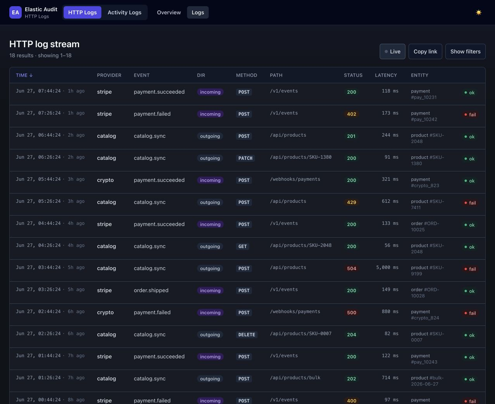

# Audit Logs (Third-Party HTTP)

[Back to Elastic Audit](README.md) · [Activity Logs](ACTIVITY_LOGS.md)




This guide covers the third-party HTTP audit subsystem: outgoing provider calls, incoming callbacks, latency,
status codes, entity context, and sanitized request/response payload previews. It is independent from the
[Activity Logs](ACTIVITY_LOGS.md) subsystem and can be enabled on its own.

## Project Documents

- [Changelog](CHANGELOG.md)
- [Upgrade Guide](UPGRADE.md)
- [Contributing](CONTRIBUTING.md)
- [Coding Standards](CODING_STANDARDS.md)

## Table of Contents

- [Project Documents](#project-documents)
- [Quick Start](#quick-start)
- [Requirements](#requirements)
- [Installation](#installation)
- [Publish Configuration](#publish-configuration)
- [Environment Variables](#environment-variables)
- [Configuration Reference](#configuration-reference)
- [Register Application Enums](#register-application-enums)
- [What Gets Logged](#what-gets-logged)
- [Create Elasticsearch Index](#create-elasticsearch-index)
- [Logging Outgoing Requests](#logging-outgoing-requests)
- [Logging Incoming Callbacks](#logging-incoming-callbacks)
- [Manual Incoming Logging](#manual-incoming-logging)
- [Queues](#queues)
- [Dashboard](#dashboard)
- [Pruning Old Logs](#pruning-old-logs)
- [Redaction Notes](#redaction-notes)
- [Sampling](#sampling)
- [Troubleshooting](#troubleshooting)
- [Development / Testing](#development--testing)
- [Testing Example](#testing-example)
- [Searching Logs in Elasticsearch](#searching-logs-in-elasticsearch)

## Quick Start

1. Add the GitLab repository to the consuming application's `composer.json`.
2. Install the package:

    ```bash
    composer require tsitsishvili/elastic-audit:^1.0
    ```

3. Publish the config files and enum stubs:

    ```bash
    php artisan vendor:publish --tag=elastic-audit
    ```

4. Register the application's provider, event type, and entity type enums in `config/http_logs.php`.
5. Configure Elasticsearch and enable logging in `.env`.
6. Create the Elasticsearch index and aliases:

    ```bash
    php artisan http-logs:create-index
    ```

7. Run a queue worker for the configured logs queue:

    ```bash
    php artisan queue:work --queue=default
    ```

8. Use `HttpLog::make(...)` for outgoing provider calls or `IncomingHttpLogMiddleware` for incoming callbacks.

## Requirements

- PHP `^8.2`
- Laravel `^12.0 || ^13.0`
- Elasticsearch PHP client `^8.5 || ^9.0`
- A queue worker, because logs are indexed through queued jobs

## Installation

Add the package repository to the consuming application's `composer.json`.

```json
{
  "repositories": [
    {
      "type": "vcs",
      "url": "git@gitlab.tsitsishvili.ge:laravel-packages/http-logs.git"
    }
  ]
}
```

Install a tagged version:

```bash
composer require tsitsishvili/elastic-audit:^1.0
```

Laravel auto-discovers the package service provider.

## Publish Configuration

```bash
php artisan vendor:publish --tag=elastic-audit
```

This publishes:

```text
config/http_logs.php
config/log_elasticsearch.php
app/Enums/ElasticAudit/Provider.php
app/Enums/ElasticAudit/EventType.php
app/Enums/ElasticAudit/EntityType.php
```

The enum stubs are starting-point implementations of the three package contracts. Edit them to match the providers and
event types used by the application.

## Environment Variables

```dotenv
HTTP_LOGS_ENABLED=true
HTTP_LOGS_QUEUE=default
HTTP_LOGS_SAMPLE_RATE=1.0
HTTP_LOGS_BODY_PREVIEW_BYTES=4096
HTTP_LOGS_BODY_MAX_BYTES=32768
HTTP_LOGS_PAYMENT_BODY_MODE=preview

HTTP_LOGS_DASHBOARD_ENABLED=true
ELASTIC_AUDIT_DASHBOARD_PREFIX=logger
HTTP_LOGS_DASHBOARD_PATH=third-party

LOG_ELASTICSEARCH_HOST=localhost
LOG_ELASTICSEARCH_PORT=9200
LOG_ELASTICSEARCH_SCHEME=http
LOG_ELASTICSEARCH_USERNAME=
LOG_ELASTICSEARCH_PASSWORD=
LOG_ELASTICSEARCH_INDEX_PREFIX=my_app
LOG_ELASTICSEARCH_REPLICAS=1
```

| Variable                         | Description                                                                                                                        |
|----------------------------------|------------------------------------------------------------------------------------------------------------------------------------|
| `HTTP_LOGS_ENABLED`              | Set to `true` to enable logging.                                                                                                   |
| `HTTP_LOGS_QUEUE`                | Queue name for log jobs.                                                                                                           |
| `HTTP_LOGS_SAMPLE_RATE`          | Float `0.0`–`1.0`. `1.0` = log all, `0.0` = log none. Intermediate values sample randomly.                                         |
| `HTTP_LOGS_BODY_PREVIEW_BYTES`   | Max bytes stored as sanitized body preview.                                                                                        |
| `HTTP_LOGS_BODY_MAX_BYTES`       | Max raw body size before truncation.                                                                                               |
| `HTTP_LOGS_PAYMENT_BODY_MODE`    | Body handling mode for payment providers (`preview` or `omit`).                                                                    |
| `HTTP_LOGS_DASHBOARD_ENABLED`    | Set to `true` to register the web dashboard routes.                                                                                |
| `ELASTIC_AUDIT_DASHBOARD_PREFIX` | Shared URL prefix for both dashboards (default `logger`). Composes as `{prefix}/{path}`. Set to empty string to serve at the root. |
| `HTTP_LOGS_DASHBOARD_PATH`       | This dashboard's subpath under the group prefix (default `third-party`). Served at `/logger/third-party`.                          |

The package writes to aliases based on `LOG_ELASTICSEARCH_INDEX_PREFIX`:

```text
my_app_http_logs
my_app_http_logs_write
```

## Configuration Reference

### `http_logs.php`

| Key                         | Default                    | Description                                                                                                                                                                             |
|-----------------------------|----------------------------|-----------------------------------------------------------------------------------------------------------------------------------------------------------------------------------------|
| `enabled`                   | `false`                    | Enables or disables third-party HTTP logging. When disabled, no log jobs are dispatched.                                                                                                |
| `queue`                     | `default`                  | Queue name used by `LogHttpRequestJob`.                                                                                                                                                 |
| `sample_rate`               | `1.0`                      | Float between `0.0` and `1.0`. `1.0` logs every request, `0.0` logs none, intermediate values use probabilistic sampling (e.g. `0.1` logs ~10%). Controlled by `HTTP_LOGS_SAMPLE_RATE`. |
| `body_preview_bytes`        | `4096`                     | Maximum number of sanitized body bytes stored as preview.                                                                                                                               |
| `body_max_bytes`            | `32768`                    | Maximum raw body size considered before truncation handling.                                                                                                                            |
| `payment_body_mode`         | `preview`                  | Controls payment provider body handling.                                                                                                                                                |
| `index_alias`               | `{prefix}_http_logs`       | Elasticsearch read alias.                                                                                                                                                               |
| `index_alias_write`         | `{prefix}_http_logs_write` | Elasticsearch write alias.                                                                                                                                                              |
| `enums.provider`            | `null`                     | Backed enum class implementing `ProviderContract`.                                                                                                                                      |
| `enums.event_type`          | `null`                     | Backed enum class implementing `EventTypeContract`.                                                                                                                                     |
| `enums.entity_type`         | `null`                     | Backed enum class implementing `EntityTypeContract`.                                                                                                                                    |
| `enums.entity_type_default` | `none`                     | Fallback entity type value for incoming callback logs.                                                                                                                                  |
| `payment_provider_values`   | `[]`                       | Provider enum values that should use payment-specific redaction.                                                                                                                        |
| `redaction.headers.allow`   | `[]`                       | Header names to never redact, even when a default rule matches (exact match; takes precedence). See [Redaction Notes](#redaction-notes).                                                |
| `redaction.headers.block`   | `[]`                       | Extra header names to always redact, in addition to the defaults (whole-word match).                                                                                                    |
| `redaction.body.allow`      | `[]`                       | Body keys to never redact, even when a default rule matches (exact match; takes precedence).                                                                                            |
| `redaction.body.block`      | `[]`                       | Extra body keys to always redact, in addition to the defaults (whole-word match).                                                                                                       |
| `dashboard.enabled`         | `true`                     | Registers the web dashboard routes. Set to `false` to hide the UI entirely.                                                                                                             |
| `dashboard.prefix`          | `logger`                   | Shared group URL segment placed before every dashboard. Both dashboards read `ELASTIC_AUDIT_DASHBOARD_PREFIX`; changing it moves both at once. Set to `''` to serve at the root.        |
| `dashboard.path`            | `third-party`              | This dashboard's own subpath under the group prefix. Composes with `prefix` as `{prefix}/{path}`, e.g. `/logger/third-party`.                                                           |
| `dashboard.middleware`      | `['web']`                  | Middleware applied to dashboard routes. The package always appends its authorization middleware after this stack.                                                                       |
| `dashboard.per_page`        | `25`                       | Number of log rows shown per page in the list view.                                                                                                                                     |

### `log_elasticsearch.php`

| Key                            | Default      | Description                                                                                    |
|--------------------------------|--------------|------------------------------------------------------------------------------------------------|
| `hosts.0.host`                 | `localhost`  | Elasticsearch host used for log indexing.                                                      |
| `hosts.0.port`                 | `9200`       | Elasticsearch port.                                                                            |
| `hosts.0.scheme`               | `http`       | Elasticsearch scheme, usually `http` or `https`.                                               |
| `basicAuthentication.username` | empty string | Optional Elasticsearch basic auth username.                                                    |
| `basicAuthentication.password` | empty string | Optional Elasticsearch basic auth password.                                                    |
| `index_prefix`                 | `app_logs`   | Prefix used when creating physical indexes and aliases.                                        |
| `replicas`                     | `1`          | Number of Elasticsearch replicas for the logs index. Use `0` for single-node staging clusters. |

## Register Application Enums

Each application defines its own provider, event type, and entity type enums. These enums must implement the package
contracts.

```php
<?php

namespace App\Enums\ElasticAudit;

use Tsitsishvili\ElasticAudit\Contracts\ProviderContract;

enum Provider: string implements ProviderContract
{
    case Delivery = 'delivery';
    case Payment = 'payment';

    public function getValue(): string
    {
        return $this->value;
    }
}
```

```php
<?php

namespace App\Enums\ElasticAudit;

use Tsitsishvili\ElasticAudit\Contracts\EventTypeContract;

enum EventType: string implements EventTypeContract
{
    case DeliveryOrderCreate = 'delivery_order_create';
    case DeliveryStatusCallback = 'delivery_status_callback';
    case PaymentCallback = 'payment_callback';

    public function getValue(): string
    {
        return $this->value;
    }
}
```

```php
<?php

namespace App\Enums\ElasticAudit;

use Tsitsishvili\ElasticAudit\Contracts\EntityTypeContract;

enum EntityType: string implements EntityTypeContract
{
    case Order = 'order';
    case Payment = 'payment';
    case None = 'none';

    public function getValue(): string
    {
        return $this->value;
    }
}
```

Register them in `config/http_logs.php`:

```php
'enums' => [
    'provider' => App\Enums\Provider::class,
    'event_type' => App\Enums\EventType::class,
    'entity_type' => App\Enums\EntityType::class,
    'entity_type_default' => 'none',
],

'payment_provider_values' => [
    App\Enums\Provider::Payment->value,
],
```

Providers listed in `payment_provider_values` use the payment redactor.

## What Gets Logged

Each document is built from `HttpLogData` and includes operational metadata, entity context, sanitized payload
data, and failure information.

| Field               | Description                                                                               |
|---------------------|-------------------------------------------------------------------------------------------|
| `event_id`          | Unique ULID for the log document.                                                         |
| `@timestamp`        | Time the log data was created.                                                            |
| `request_id`        | Correlation ULID shared by the log context.                                               |
| `provider`          | Provider enum value, for example `delivery` or `payment`.                                 |
| `event_type`        | Event type enum value, for example `delivery_order_create`.                               |
| `direction`         | `outgoing` for provider calls or `incoming` for callbacks.                                |
| `http.method`       | HTTP method, for example `GET`, `POST`, or `PATCH`.                                       |
| `http.url`          | URL without query string. Query strings are stripped to avoid storing tokens or API keys. |
| `http.host`         | Parsed host from the URL.                                                                 |
| `http.path`         | Parsed path from the URL.                                                                 |
| `http.status_code`  | Response status code when available.                                                      |
| `http.status_class` | Status class such as `2xx`, `4xx`, or `5xx`.                                              |
| `latency_ms`        | Request or callback handling duration in milliseconds.                                    |
| `entity.type`       | Entity type from the log context, for example `order`.                                    |
| `entity.id`         | Internal entity identifier from the log context.                                          |
| `external_id`       | Optional external provider identifier.                                                    |
| `user_id`           | Optional application user id.                                                             |
| `attempt`           | Queue/job attempt or request attempt value.                                               |
| `success`           | Boolean success flag.                                                                     |
| `retention_days`    | Retention window used by `http-logs:prune`.                                               |
| `request`           | Sanitized request headers, body preview, body hash, and truncation flag.                  |
| `response`          | Sanitized response headers, body preview, body hash, and truncation flag.                 |
| `error.class`       | Exception class for failed outgoing calls when available.                                 |
| `error.message`     | Sanitized exception message for failed outgoing calls when available.                     |

Both incoming callback logs and outgoing request logs store request **and** response payloads. For incoming callbacks
the
response is captured automatically by `IncomingHttpLogMiddleware`, or when you pass the response to
`HttpLog::logIncoming(...)`. Outgoing request logs capture the provider's response when available.

## Create Elasticsearch Index

Create the physical index and attach read/write aliases:

```bash
php artisan http-logs:create-index
```

This command refuses to create the logs index when the configured logs Elasticsearch host matches the product-search
Elasticsearch host.

## Logging Outgoing Requests

Use `HttpLog::make(...)` to obtain a logging-aware HTTP client instead of using Laravel's `Http` facade
directly.

```php
<?php

namespace App\Services;

use App\Enums\EntityType;
use App\Enums\EventType;
use App\Enums\Provider;
use Tsitsishvili\ElasticAudit\DataTransferObjects\HttpLogContext;
use Tsitsishvili\ElasticAudit\Facades\HttpLog;

class DeliveryProviderClient
{
    public function createOrder(int $orderId): array
    {
        $context = HttpLogContext::forEntity(
            entityType: EntityType::Order,
            entityId: (string) $orderId,
            externalId: null,
            userId: auth()->id(),
            retentionDays: 360,
        );

        $response = HttpLog::make(
            provider: Provider::Delivery,
            eventType: EventType::DeliveryOrderCreate,
            context: $context,
        )
            ->timeout(10)
            ->retry(2, 200)
            ->withToken(config('services.delivery.token'))
            ->post('https://provider.example/orders', [
                'order_id' => $orderId,
            ]);

        return $response->json();
    }
}
```

`HttpLog::make(...)` returns **Laravel's own HTTP client** (`Illuminate\Http\Client\PendingRequest`) with an
outgoing-request logging middleware already attached. There is no custom wrapper — the **entire** Laravel HTTP client
API
is available and every request you make through it is logged automatically:

```php
HttpLog::make($provider, $eventType, $context)->get($url, $query);
HttpLog::make($provider, $eventType, $context)->post($url, $data);
HttpLog::make($provider, $eventType, $context)
    ->acceptJson()
    ->withBasicAuth($username, $password)
    ->withQueryParameters(['page' => 1])
    ->post($url, $data);

// Form-encoded body (application/x-www-form-urlencoded) — native Laravel, logged the same way:
HttpLog::make($provider, $eventType, $context)
    ->asForm()
    ->post('https://provider.example/oauth/token', ['grant_type' => 'client_credentials']);
```

Because logging happens at the transport (Guzzle middleware) layer, the wire format is irrelevant to logging: JSON,
form,
multipart, etc. are all redacted and stored uniformly, and no method call can bypass logging.

The original provider call behavior is preserved. If the provider request fails, the package dispatches the log job and
rethrows the original exception.

## Logging Incoming Callbacks

Register the middleware on callback routes:

```php
use App\Http\Controllers\DeliveryCallbackController;
use Illuminate\Support\Facades\Route;
use Tsitsishvili\ElasticAudit\Http\Middleware\IncomingHttpLogMiddleware;

Route::post('/callbacks/delivery', DeliveryCallbackController::class)
    ->middleware(IncomingHttpLogMiddleware::class);
```

Set trusted request attributes server-side before the response is returned. The middleware reads these attributes after
the request has been handled.

```php
<?php

namespace App\Http\Controllers;

use App\Enums\EntityType;
use App\Enums\EventType;
use App\Enums\Provider;
use Illuminate\Http\Request;

class DeliveryCallbackController
{
    public function __invoke(Request $request)
    {
        $orderId = (string) $request->input('order_id', 'unknown');

        $request->attributes->set('third_party_provider', Provider::Delivery->value);
        $request->attributes->set('third_party_event_type', EventType::DeliveryStatusCallback->value);
        $request->attributes->set('third_party_entity_type', EntityType::Order->value);
        $request->attributes->set('third_party_entity_id', $orderId);

        // Handle the callback...

        return response()->json(['received' => true]);
    }
}
```

Do not resolve provider or event type from URL segments or request input. Set these values from application code so
user-controlled data cannot spoof log metadata.

The middleware automatically logs the response it returns (status code, headers, and sanitized body) alongside the
request — no extra code is required.

## Manual Incoming Logging

If middleware is not a good fit, call `HttpLog::logIncoming(...)` directly.

```php
use App\Enums\EntityType;
use App\Enums\EventType;
use App\Enums\Provider;
use Illuminate\Http\Request;
use Tsitsishvili\ElasticAudit\DataTransferObjects\HttpLogContext;
use Tsitsishvili\ElasticAudit\Facades\HttpLog;

public function webhook(Request $request)
{
    $context = HttpLogContext::forEntity(
        entityType: EntityType::Payment,
        entityId: (string) $request->input('payment_id', 'unknown'),
        retentionDays: 180,
    );

    // Build the response first so it can be logged, then return the same instance.
    $response = response()->json(['ok' => true]);

    HttpLog::logIncoming(
        request: $request,
        provider: Provider::Payment,
        eventType: EventType::PaymentCallback,
        context: $context,
        latencyMs: 0,
        httpStatusCode: $response->getStatusCode(),
        success: true,
        response: $response, // optional — captures sanitized response headers and body
    );

    return $response;
}
```

## Queues

Logs are dispatched through `LogHttpRequestJob`.

Run a worker for the configured queue:

```bash
php artisan queue:work --queue=default
```

If you use a dedicated queue:

```dotenv
HTTP_LOGS_QUEUE=logs
```

```bash
php artisan queue:work --queue=logs
```

## Dashboard

The package ships a Horizon-style web dashboard for browsing logged requests. It reads directly from the
Elasticsearch read alias and is rendered with server-side Blade (Tailwind + Alpine via CDN) — there is no build
step and no assets to compile or publish.

Once the package is installed it is served (by default) at:

```text
/logger/third-party
```

It provides three views:

- **Overview** — totals, success rate, 4xx/5xx counts, average/p95 latency, a throughput chart, and breakdowns by
  status class and provider.
- **Logs** — a paginated, filterable table (provider, event type, direction, status class, success, entity id, and a
  date range). Each row links to its detail view.
- **Log detail** — full operational metadata plus sanitized request/response headers, body previews, body hashes, and
  error information for a single log document.

### Access control

Access is gated by an authorization callback. **By default the dashboard is only reachable in the `local`
environment** — every other environment is denied until you grant access explicitly.

Register a callback from any service provider's `boot()` method (for example `App\Providers\AppServiceProvider`):

```php
use Tsitsishvili\ElasticAudit\Dashboard\Dashboard;

public function boot(): void
{
    Dashboard::auth(fn ($request) => $request->user()?->isAdmin() === true);
}
```

The callback receives the current `Illuminate\Http\Request` and must return a boolean. Requests that fail it receive
a `403`.

### Configuration

```php
// config/http_logs.php
'dashboard' => [
    'enabled'    => env('HTTP_LOGS_DASHBOARD_ENABLED', true),
    'prefix'     => env('ELASTIC_AUDIT_DASHBOARD_PREFIX', 'logger'),
    'path'       => env('HTTP_LOGS_DASHBOARD_PATH', 'third-party'),
    'middleware' => ['web'],
    'per_page'   => 25,
],
```

Set `enabled` to `false` to omit the routes completely. The package always appends its own authorization middleware
after the configured `middleware` stack.

### Customizing the views

To override the bundled Blade templates, publish them and edit the copies in your application:

```bash
php artisan vendor:publish --tag=elastic-audit-views
```

This publishes the views to `resources/views/vendor/elastic-audit`.

## Pruning Old Logs

Each log document stores `retention_days` from `HttpLogContext`.

Run pruning manually:

```bash
php artisan http-logs:prune
```

Schedule it in the consuming application:

```php
use Illuminate\Support\Facades\Schedule;

Schedule::command('http-logs:prune')->dailyAt('03:00');
```

## Redaction Notes

The package sanitizes headers, request bodies, response bodies, and exception messages before indexing. Query strings
are stripped from stored URLs because they can contain API keys or tokens.

### How matching works

Sensitive header names and body keys are matched as **whole words**, not raw substrings. Names are first normalized —
`camelCase`, `kebab-case`, dotted and spaced variants all fold to `snake_case`, so `accessToken`, `access-token`, and
`access_token` are treated identically. A built-in word only matches at a word boundary, so it never fires inside a
larger word (e.g. `key` does not match `monkey` or `keyword`).

Most secret words (`password`, `secret`, `signature`, `hmac`, `authorization`, `credential`, …) match in any position,
so compound keys like `password_confirmation` and `webhook_secret` are redacted. The positional words `token` and `key`
match only as the **final** word, so `access_token` / `x-api-key` are redacted while the non-secret `token_type` and
`token_expires_in` are kept.

### Customizing what gets redacted

You can extend or override the built-in rules per surface (headers vs. body) without forking the package, via the
`redaction` config — kept separate for headers and body so a body rule never affects a header and vice versa:

```php
// config/http_logs.php
'redaction' => [
    'headers' => [
        'block' => ['x-internal-trace'], // always redact this header (in addition to defaults)
        'allow' => [],
    ],
    'body' => [
        'block' => ['customer_reference'], // whole-word: also redacts 'customerReference'
        'allow' => ['email'],              // keep emails in logs, even though 'email' is redacted by default
    ],
],
```

- **`block`** — extra names to always redact, matched as whole words exactly like the built-ins. The word `reference`
  blocks any `*_reference` key.
- **`allow`** — names to never redact, even when a built-in or `block` rule matches. Matched **exactly** (after
  normalization), so it un-redacts only the named field, not a whole family — and it takes precedence over everything
  else. Use with care: anything listed here is stored in clear text.

Body storage is controlled by:

```dotenv
HTTP_LOGS_BODY_PREVIEW_BYTES=4096
HTTP_LOGS_BODY_MAX_BYTES=32768
HTTP_LOGS_PAYMENT_BODY_MODE=preview
```

For payment providers, add the provider enum value to `payment_provider_values`.

> Activity logging applies the same redaction to its `changes` and `metadata` maps — see
> [Activity Logs](ACTIVITY_LOGS.md).

## Sampling

Control what fraction of requests are logged using the `sample_rate` config key (or `HTTP_LOGS_SAMPLE_RATE` env
variable).

| Value | Behaviour                                      |
|-------|------------------------------------------------|
| `1.0` | Every request is logged (default).             |
| `0.0` | No requests are logged.                        |
| `0.1` | ~10% of requests are logged, chosen at random. |

Sampling is applied independently to each request via `mt_rand()` before any payload is built or any job dispatched, so
skipped requests have zero overhead beyond the random check. Setting `sample_rate` to `1.0` skips the random check
entirely.

```dotenv
# Log roughly 25% of requests
HTTP_LOGS_SAMPLE_RATE=0.25
```

> **Note:** Sampling is statistical. At low rates and low traffic volumes the actual percentage may deviate noticeably
> from the configured value.

## Troubleshooting

### No logs are created

Check that logging is enabled:

```dotenv
HTTP_LOGS_ENABLED=true
```

Also confirm the consuming application is using `HttpLog::make(...)` for outgoing requests or
`IncomingHttpLogMiddleware` / `HttpLog::logIncoming(...)` for incoming callbacks.

### Log jobs are dispatched but documents do not appear in Elasticsearch

Check that a queue worker is running for the configured queue:

```bash
php artisan queue:work --queue=default
```

If `HTTP_LOGS_QUEUE=logs`, run:

```bash
php artisan queue:work --queue=logs
```

### Elasticsearch index or alias is missing

Create the index and aliases:

```bash
php artisan http-logs:create-index
```

Confirm `LOG_ELASTICSEARCH_INDEX_PREFIX` matches the alias you are querying.

### Cannot connect to Elasticsearch

Verify the logs cluster settings:

```dotenv
LOG_ELASTICSEARCH_HOST=localhost
LOG_ELASTICSEARCH_PORT=9200
LOG_ELASTICSEARCH_SCHEME=http
LOG_ELASTICSEARCH_USERNAME=
LOG_ELASTICSEARCH_PASSWORD=
```

The `http-logs:create-index` command will fail if the logs Elasticsearch host matches the configured
product-search Elasticsearch host.

### Incoming callback logs are skipped

The callback middleware only logs when these request attributes are set by server-side code:

```php
$request->attributes->set('third_party_provider', Provider::Delivery->value);
$request->attributes->set('third_party_event_type', EventType::DeliveryStatusCallback->value);
$request->attributes->set('third_party_entity_type', EntityType::Order->value);
$request->attributes->set('third_party_entity_id', $orderId);
```

Provider, event type, and entity type enum classes must also be registered in `config/http_logs.php`.

### Payment data appears too detailed

Add payment provider enum values to `payment_provider_values`:

```php
'payment_provider_values' => [
    App\Enums\Provider::Payment->value,
],
```

Then review:

```dotenv
HTTP_LOGS_PAYMENT_BODY_MODE=preview
HTTP_LOGS_BODY_PREVIEW_BYTES=4096
HTTP_LOGS_BODY_MAX_BYTES=32768
```

### Config changes are not applied

Clear Laravel's cached config:

```bash
php artisan config:clear
```

## Development / Testing

Install package dependencies:

```bash
composer install
```

Validate Composer metadata:

```bash
composer validate --no-check-publish
```

The package includes `phpunit.xml` with separate Unit and Feature test suites.

Before running the tests in a fresh checkout, make sure the package has these development dependencies installed:

```bash
composer require --dev phpunit/phpunit orchestra/testbench
```

Run all tests:

```bash
vendor/bin/phpunit
```

Run only unit tests:

```bash
vendor/bin/phpunit --testsuite Unit
```

Run only feature tests:

```bash
vendor/bin/phpunit --testsuite Feature
```

Useful checks before opening a merge request:

```bash
composer validate --no-check-publish
vendor/bin/phpunit
```

## Testing Example

### Integration-style tests

Fake Laravel's bus and HTTP client so the facade still executes real application code but
no real HTTP calls are made and no log jobs are dispatched to a queue:

```php
use Illuminate\Support\Facades\Bus;
use Illuminate\Support\Facades\Http;
use Tsitsishvili\ElasticAudit\Jobs\LogHttpRequestJob;

Bus::fake();

Http::fake([
    'https://provider.example/*' => Http::response(['ok' => true], 200),
]);

// Execute code that calls HttpLog::make(...)

Bus::assertDispatched(LogHttpRequestJob::class);
```

### Unit tests — faking the facade with a spy

Use `HttpLog::spy()` to replace the underlying manager with a Mockery spy. The spy
records every call but executes no real code, so no HTTP requests are made and no jobs are
dispatched. This is appropriate when the subject under test calls the facade and you want to
assert what it called without wiring up the full stack.

```php
use App\Enums\ElasticAudit\EventType;
use App\Enums\ElasticAudit\Provider;
use Tsitsishvili\ElasticAudit\DataTransferObjects\HttpLogContext;
use Tsitsishvili\ElasticAudit\Facades\HttpLog;

HttpLog::spy();

// Execute code that calls HttpLog::make(...)

HttpLog::shouldReceive('make')
    ->once()
    ->with(
        Provider::Delivery,
        EventType::DeliveryOrderCreate,
        \Mockery::type(HttpLogContext::class),
    );
```

To assert the facade was never called:

```php
HttpLog::spy();

// Execute code that should NOT trigger logging

HttpLog::shouldReceive('make')->never();
```

### Unit tests — controlling responses with `Http::fake()`

Because `make()` returns Laravel's real `PendingRequest`, you stub provider responses with
`Http::fake()` and assert the outgoing call with `Http::assertSent()` — exactly as you would test
any code that uses the `Http` facade. There is no custom client to mock.

```php
use Illuminate\Support\Facades\Http;

Http::fake([
    'provider.example/*' => Http::response(['ok' => true], 200),
]);

// Execute code under test — it calls HttpLog::make(...)->post('https://provider.example/orders', ...)

Http::assertSent(function (\Illuminate\Http\Client\Request $request) {
    return $request->url() === 'https://provider.example/orders'
        && $request['order_id'] === 1;
});
```

To assert the request was sent as a form, use `$request->isForm()`; for JSON, `$request->isJson()`.

If you also want to assert that the logging job was queued, fake the bus and check for the job:

```php
use Illuminate\Support\Facades\Bus;
use Tsitsishvili\ElasticAudit\Jobs\LogHttpRequestJob;

Bus::fake();
Http::fake(['provider.example/*' => Http::response(['ok' => true], 200)]);

// Execute code under test

Bus::assertDispatched(LogHttpRequestJob::class);
```

If you only need to assert that `make()` was called with a particular provider/event/context (and do
not care about the HTTP exchange), you can still spy on the facade as shown above with
`HttpLog::spy()` + `shouldReceive('make')`.

## Searching Logs in Elasticsearch

The package writes documents to the read alias configured as `index_alias` in
`config/http_logs.php` (defaults to `{prefix}_http_logs`).

### Using the PHP client

Resolve `LogElasticsearchClientInterface` from the container and call `search()`:

```php
use Tsitsishvili\ElasticAudit\Services\Elasticsearch\LogElasticsearchClientInterface;

$client = app(LogElasticsearchClientInterface::class);

$results = $client->search([
    'index' => config('http_logs.index_alias'),
    'body'  => [
        'query' => [
            'bool' => [
                'must'   => [
                    ['term' => ['provider'     => 'delivery']],
                    ['term' => ['entity.type'  => 'order']],
                    ['term' => ['entity.id'    => (string) $orderId]],
                ],
                'filter' => [
                    ['range' => ['@timestamp' => ['gte' => 'now-7d', 'lt' => 'now']]],
                ],
            ],
        ],
        'sort' => [['@timestamp' => ['order' => 'desc']]],
        'size' => 50,
    ],
]);

$hits = $results['hits']['hits'];
```

### Common filter combinations

**All failed outgoing requests for a provider:**

```json
{
  "query": {
    "bool": {
      "must": [
        {
          "term": {
            "provider": "delivery"
          }
        },
        {
          "term": {
            "direction": "outgoing"
          }
        },
        {
          "term": {
            "success": false
          }
        }
      ]
    }
  },
  "sort": [
    {
      "@timestamp": {
        "order": "desc"
      }
    }
  ],
  "size": 100
}
```

**All logs for a specific entity (e.g., order 42) across providers:**

```json
{
  "query": {
    "bool": {
      "must": [
        {
          "term": {
            "entity.type": "order"
          }
        },
        {
          "term": {
            "entity.id": "42"
          }
        }
      ]
    }
  },
  "sort": [
    {
      "@timestamp": {
        "order": "desc"
      }
    }
  ],
  "size": 50
}
```

**Slow outgoing requests (latency over 3 seconds) in the last 24 hours:**

```json
{
  "query": {
    "bool": {
      "must": [
        {
          "term": {
            "direction": "outgoing"
          }
        }
      ],
      "filter": [
        {
          "range": {
            "http.latency_ms": {
              "gte": 3000
            }
          }
        },
        {
          "range": {
            "@timestamp": {
              "gte": "now-24h"
            }
          }
        }
      ]
    }
  },
  "sort": [
    {
      "http.latency_ms": {
        "order": "desc"
      }
    }
  ],
  "size": 50
}
```

**5xx responses by provider in the last hour:**

```json
{
  "query": {
    "bool": {
      "must": [
        {
          "term": {
            "http.status_class": "5xx"
          }
        }
      ],
      "filter": [
        {
          "range": {
            "@timestamp": {
              "gte": "now-1h"
            }
          }
        }
      ]
    }
  },
  "aggs": {
    "by_provider": {
      "terms": {
        "field": "provider",
        "size": 20
      }
    }
  },
  "size": 0
}
```

**Incoming callbacks for a specific event type:**

```json
{
  "query": {
    "bool": {
      "must": [
        {
          "term": {
            "direction": "incoming"
          }
        },
        {
          "term": {
            "event_type": "delivery_status_callback"
          }
        }
      ],
      "filter": [
        {
          "range": {
            "@timestamp": {
              "gte": "now-7d"
            }
          }
        }
      ]
    }
  },
  "sort": [
    {
      "@timestamp": {
        "order": "desc"
      }
    }
  ],
  "size": 50
}
```

All queries can be run directly in Kibana Dev Tools against the read alias. Replace
`my_app_http_logs` with the alias configured for your application.
