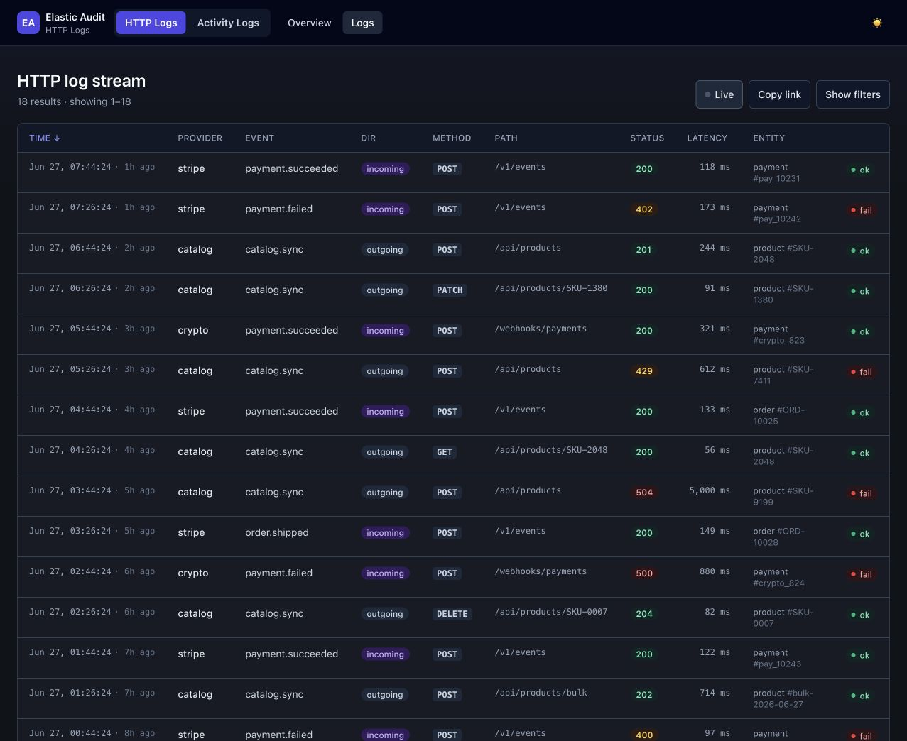

# Audit Logs (Third-Party HTTP)

[Back to Elastic Audit](README.md) · [Activity Logs](ACTIVITY_LOGS.md)




This guide covers the third-party HTTP audit subsystem: outgoing provider calls, incoming callbacks, latency,
status codes, entity context, and sanitized request/response payload previews. It is independent from the
[Activity Logs](ACTIVITY_LOGS.md) subsystem and can be enabled on its own.

## Project Documents

- [Agent Guide](AGENTS.md)
- [Changelog](CHANGELOG.md)
- [Upgrade Guide](UPGRADE.md)
- [Contributing](https://github.com/tsitsishvili/elastic-audit/blob/main/CONTRIBUTING.md)
- [Coding Standards](https://github.com/tsitsishvili/elastic-audit/blob/main/CODING_STANDARDS.md)

## Table of Contents

- [Project Documents](#project-documents)
- [Quick Start](#quick-start)
- [Requirements](#requirements)
- [Installation](#installation)
- [Publish Configuration](#publish-configuration)
- [Environment Variables](#environment-variables)
- [Configuration Reference](#configuration-reference)
- [Register Application Enums](#register-application-enums)
- [What Gets Logged](#what-gets-logged)
- [Create Elasticsearch Index](#create-elasticsearch-index)
- [Logging Outgoing Requests](#logging-outgoing-requests)
- [Logging Incoming Callbacks](#logging-incoming-callbacks)
- [Manual Incoming Logging](#manual-incoming-logging)
- [Queues](#queues)
- [Dashboard](#dashboard)
- [Pruning Old Logs](#pruning-old-logs)
- [Redaction Notes](#redaction-notes)
- [Sampling](#sampling)
- [Troubleshooting](#troubleshooting)
- [Development / Testing](#development--testing)
- [Testing Example](#testing-example)
- [Searching Logs in Elasticsearch](#searching-logs-in-elasticsearch)

## Quick Start

1. Install the stable v4 release from Packagist:

    ```bash
    composer require tsitsishvili/elastic-audit:^4.0
    ```

2. Publish the config files and enum stubs:

    ```bash
    php artisan vendor:publish --tag=elastic-audit
    ```

3. Register the application's provider, event type, and entity type enums in `config/http_logs.php`.
4. Configure Elasticsearch and enable logging in `.env`.
5. Install the lifecycle policy, then create the Elasticsearch index and aliases:

    ```bash
    php artisan elastic-audit:lifecycle-policy
    php artisan http-logs:create-index
    ```

6. Run a queue worker for the configured logs queue:

    ```bash
    php artisan queue:work --queue=default
    ```

7. Use `HttpLog::make(...)` for outgoing provider calls or `IncomingHttpLogMiddleware` for incoming callbacks.

## Requirements

- PHP `^8.2`
- Laravel `^12.0 || ^13.0`
- Elasticsearch PHP client `^8.5 || ^9.0`
- A queue worker, because logs are indexed through queued jobs

## Installation

Install the stable v4 release from Packagist:

```bash
composer require tsitsishvili/elastic-audit:^4.0
```

Laravel auto-discovers the package service provider.

## Publish Configuration

```bash
php artisan vendor:publish --tag=elastic-audit
```

This publishes:

```text
config/http_logs.php
config/log_elasticsearch.php
config/activity_logs.php
app/Enums/ElasticAudit/Provider.php
app/Enums/ElasticAudit/EventType.php
app/Enums/ElasticAudit/EntityType.php
public/vendor/elastic-audit/*
```

The enum stubs are starting-point implementations of the three package contracts. Edit them to match the providers and
event types used by the application.

The public asset copy is optional. Dashboard assets are also served directly from the Composer package through a
manifest-allowlisted route, so a missing or stale published copy does not break the dashboard.

## Environment Variables

```dotenv
APP_NAME=my_app
APP_ENV=production

HTTP_LOGS_ENABLED=true
HTTP_LOGS_QUEUE=default
HTTP_LOGS_JOB_TRIES=3
HTTP_LOGS_JOB_BACKOFF=10,30,120
HTTP_LOGS_JOB_TIMEOUT=30
HTTP_LOGS_BATCH_JOB_TIMEOUT=60
HTTP_LOGS_SAMPLE_RATE=1.0
HTTP_LOGS_RETENTION_DAYS=360
HTTP_LOGS_RETAIN_FOREVER=false
HTTP_LOGS_BODY_PREVIEW_BYTES=4096
HTTP_LOGS_BODY_MAX_BYTES=32768
HTTP_LOGS_BODY_CAPTURE_MAX_BYTES=1048576
HTTP_LOGS_UNDECODABLE_BODY_MODE=metadata
HTTP_LOGS_PAYMENT_BODY_MODE=preview

HTTP_LOGS_DASHBOARD_ENABLED=true
ELASTIC_AUDIT_DASHBOARD_PREFIX=logger
HTTP_LOGS_DASHBOARD_PATH=http-logs

LOG_ELASTICSEARCH_LIFECYCLE_ENABLED=true
LOG_ELASTICSEARCH_LIFECYCLE_POLICY=my_app_elastic_audit_policy
LOG_ELASTICSEARCH_ROLLOVER_MAX_AGE=30d
LOG_ELASTICSEARCH_ROLLOVER_MAX_SHARD_SIZE=50gb
LOG_ELASTICSEARCH_LIFECYCLE_DELETE_ENABLED=true
LOG_ELASTICSEARCH_LIFECYCLE_DELETE_AFTER=360d

LOG_ELASTICSEARCH_HOST=localhost
LOG_ELASTICSEARCH_PORT=9200
LOG_ELASTICSEARCH_SCHEME=http
LOG_ELASTICSEARCH_USERNAME=
LOG_ELASTICSEARCH_PASSWORD=
LOG_ELASTICSEARCH_INDEX_PREFIX=my_app
LOG_ELASTICSEARCH_REPLICAS=1
```

| Variable                                    | Description                                                                                                                        |
|---------------------------------------------|------------------------------------------------------------------------------------------------------------------------------------|
| `APP_NAME`                                  | Application identity indexed on both HTTP and activity documents. Keep it stable and unique when aliases are shared.               |
| `APP_ENV`                                   | Deployment environment indexed with the application identity.                                                                      |
| `HTTP_LOGS_ENABLED`                         | Set to `true` to enable logging.                                                                                                   |
| `HTTP_LOGS_QUEUE`                           | Queue name for log jobs.                                                                                                           |
| `HTTP_LOGS_JOB_TRIES`                       | Attempts for each queued HTTP log job.                                                                                             |
| `HTTP_LOGS_JOB_BACKOFF`                     | Comma-separated retry backoff seconds for HTTP log jobs.                                                                           |
| `HTTP_LOGS_JOB_TIMEOUT`                     | Timeout in seconds for single HTTP log jobs.                                                                                       |
| `HTTP_LOGS_BATCH_JOB_TIMEOUT`               | Timeout in seconds for HTTP bulk replay jobs.                                                                                      |
| `HTTP_LOGS_SAMPLE_RATE`                     | Float `0.0`–`1.0`. `1.0` = log all, `0.0` = log none. Intermediate values sample randomly.                                         |
| `HTTP_LOGS_RETENTION_DAYS`                  | Default finite document retention; must be an integer from `1` through `32767`.                                                    |
| `HTTP_LOGS_RETAIN_FOREVER`                  | When `true`, HTTP documents default to permanent retention and are ignored by the prune command.                                  |
| `HTTP_LOGS_BODY_PREVIEW_BYTES`              | Max bytes stored as sanitized body preview.                                                                                        |
| `HTTP_LOGS_BODY_MAX_BYTES`                  | Max bytes retained after a body is decoded and redacted.                                                                           |
| `HTTP_LOGS_BODY_CAPTURE_MAX_BYTES`          | Bodies larger than this byte limit are captured headers-only.                                                                      |
| `HTTP_LOGS_UNDECODABLE_BODY_MODE`           | `metadata` stores a hash for undecodable bodies; `preview` stores their raw clear-text preview.                                    |
| `HTTP_LOGS_PAYMENT_BODY_MODE`               | Body handling mode for payment providers (`preview` or `metadata`).                                                                |
| `HTTP_LOGS_DASHBOARD_ENABLED`               | Set to `true` to register the web dashboard routes.                                                                                |
| `ELASTIC_AUDIT_DASHBOARD_PREFIX`            | Shared URL prefix for both dashboards (default `logger`). Composes as `{prefix}/{path}`. Set to empty string to serve at the root. |
| `HTTP_LOGS_DASHBOARD_PATH`                  | This dashboard's subpath under the group prefix (default `http-logs`). Served at `/logger/http-logs`.                              |
| `LOG_ELASTICSEARCH_LIFECYCLE_ENABLED`       | Attaches ILM settings to newly created indexes. Defaults to `true` for newly published configs.                                   |
| `LOG_ELASTICSEARCH_LIFECYCLE_POLICY`        | Shared ILM policy name for HTTP and activity log indexes.                                                                          |
| `LOG_ELASTICSEARCH_ROLLOVER_MAX_AGE`        | Max index age condition used by rollover.                                                                                          |
| `LOG_ELASTICSEARCH_ROLLOVER_MAX_SHARD_SIZE` | Max primary shard size condition used by rollover.                                                                                 |
| `LOG_ELASTICSEARCH_LIFECYCLE_DELETE_ENABLED` | Include the ILM whole-index delete phase. Set to `false` to retain rolled-over indexes forever.                                   |
| `LOG_ELASTICSEARCH_LIFECYCLE_DELETE_AFTER`  | Whole-index ILM delete age; it does not enforce document `retention_days`.                                                         |
| `LOG_ELASTICSEARCH_INDEX_PREFIX`            | Shared prefix for derived HTTP/activity aliases and the lifecycle policy. Defaults to a slugged `APP_NAME`, then `app_logs`.       |
| `LOG_ELASTICSEARCH_REPLICAS`                | Replica count for newly created indexes. Defaults to `1`; use `0` only for an intentional single-node cluster.                    |

The package writes to aliases based on `LOG_ELASTICSEARCH_INDEX_PREFIX`. When that variable is absent, the `APP_NAME`
fallback is slugged (for example, `Example App` becomes `example_app`); an explicit invalid prefix is rejected by the
health and create-index commands:

```text
my_app_http_logs
my_app_http_logs_write
```

## Configuration Reference

Application identity is read from Laravel's existing `config('app.name')` and `config('app.env')` values; the package
does not add a separate source configuration file.

### `http_logs.php`

| Key                         | Default                    | Description                                                                                                                                                                             |
|-----------------------------|----------------------------|-----------------------------------------------------------------------------------------------------------------------------------------------------------------------------------------|
| `enabled`                   | `false`                    | Enables or disables third-party HTTP logging. When disabled, no log jobs are dispatched.                                                                                                |
| `queue`                     | `default`                  | Queue name used by `LogHttpRequestJob`.                                                                                                                                                 |
| `job.tries`                 | `3`                        | Attempts for single and batch HTTP log jobs.                                                                                                                                            |
| `job.backoff`               | `[10, 30, 120]`            | Retry backoff seconds for single and batch HTTP log jobs.                                                                                                                               |
| `job.timeout`               | `30`                       | Timeout in seconds for `LogHttpRequestJob`.                                                                                                                                             |
| `job.batch_timeout`         | `60`                       | Timeout in seconds for `LogHttpRequestBatchJob`.                                                                                                                                        |
| `sample_rate`               | `1.0`                      | Float between `0.0` and `1.0`. `1.0` logs every request, `0.0` logs none, intermediate values use probabilistic sampling (e.g. `0.1` logs ~10%). Controlled by `HTTP_LOGS_SAMPLE_RATE`. |
| `retention_days`            | `360`                      | Integer `1`–`32767`; default finite document retention when the context does not set one.                                                                                               |
| `retain_forever`            | `false`                    | Makes permanent retention the default. An explicit context `retentionDays` still opts that document into finite retention.                                                             |
| `body_preview_bytes`        | `4096`                     | Maximum number of sanitized body bytes stored as preview.                                                                                                                               |
| `body_max_bytes`            | `32768`                    | Maximum bytes retained after decoding and redaction.                                                                                                                                    |
| `body_capture_max_bytes`    | `1048576`                  | Bodies larger than this are captured headers-only, without decoding or hashing them in memory.                                                                                          |
| `undecodable_body_mode`     | `metadata`                 | XML, plain text, and other non-key/value bodies: `metadata` keeps headers plus a raw-body hash; `preview` stores the raw body in clear text.                                           |
| `payment_body_mode`         | `preview`                  | Controls payment provider body handling.                                                                                                                                                |
| `index_alias`               | `null`                     | Elasticsearch read alias; `null` derives `{prefix}_http_logs`.                                                                                                                          |
| `index_alias_write`         | `null`                     | Elasticsearch write alias; `null` derives `{prefix}_http_logs_write`.                                                                                                                   |
| `enums.provider`            | `null`                     | Backed enum class implementing `ProviderContract`.                                                                                                                                      |
| `enums.event_type`          | `null`                     | Backed enum class implementing `EventTypeContract`.                                                                                                                                     |
| `enums.entity_type`         | `null`                     | Backed enum class implementing `EntityTypeContract`.                                                                                                                                    |
| `enums.entity_type_default` | `none`                     | Fallback entity type value for incoming callback logs.                                                                                                                                  |
| `payment_provider_values`   | `[]`                       | Provider enum values that should use payment-specific redaction.                                                                                                                        |
| `redaction.headers.allow`   | `[]`                       | Header names to never redact, even when a default rule matches (exact match; takes precedence). See [Redaction Notes](#redaction-notes).                                                |
| `redaction.headers.block`   | `[]`                       | Extra header names to always redact, in addition to the defaults (whole-word match).                                                                                                    |
| `redaction.body.allow`      | `[]`                       | Body keys to never redact, even when a default rule matches (exact match; takes precedence).                                                                                            |
| `redaction.body.block`      | `[]`                       | Extra body keys to always redact, in addition to the defaults (whole-word match).                                                                                                       |
| `dashboard.enabled`         | `true`                     | Registers the web dashboard routes. Set to `false` to hide the UI entirely.                                                                                                             |
| `dashboard.prefix`          | `logger`                   | Shared group URL segment placed before every dashboard. Both dashboards read `ELASTIC_AUDIT_DASHBOARD_PREFIX`; changing it moves both at once. Set to `''` to serve at the root.        |
| `dashboard.path`            | `http-logs`                | This dashboard's own subpath under the group prefix. Composes with `prefix` as `{prefix}/{path}`, e.g. `/logger/http-logs`.                                                             |
| `dashboard.middleware`      | `['web']`                  | Middleware applied to dashboard routes. The package always appends its authorization middleware after this stack.                                                                       |
| `dashboard.per_page`        | `25`                       | Number of log rows shown per page in the list view.                                                                                                                                     |

### `log_elasticsearch.php`

| Key                                 | Default                         | Description                                                                                                                |
|-------------------------------------|---------------------------------|----------------------------------------------------------------------------------------------------------------------------|
| `hosts.0.host`                      | `localhost`                     | Elasticsearch host used for log indexing.                                                                                  |
| `hosts.0.port`                      | `9200`                          | Elasticsearch port.                                                                                                        |
| `hosts.0.scheme`                    | `http`                          | Elasticsearch scheme, usually `http` or `https`.                                                                           |
| `basicAuthentication.username`      | empty string                    | Optional Elasticsearch basic auth username.                                                                                |
| `basicAuthentication.password`      | empty string                    | Optional Elasticsearch basic auth password.                                                                                |
| `index_prefix`                      | slugged `APP_NAME`              | Prefix used when creating physical indexes and aliases; falls back to `app_logs` when the slug is empty.                    |
| `replicas`                          | `1`                             | Number of Elasticsearch replicas for the logs index. Set to `0` only for a single-node cluster.                             |
| `lifecycle.enabled`                 | `true`                          | Attaches ILM settings to newly created indexes. The policy command can still create/update the policy while this is false. |
| `lifecycle.policy_name`             | `{prefix}_elastic_audit_policy` | ILM policy name used by both HTTP and activity log indexes.                                                                |
| `lifecycle.rollover_max_age`        | `30d`                           | Max index age condition passed to rollover.                                                                                |
| `lifecycle.rollover_max_shard_size` | `50gb`                          | Max primary shard size condition passed to rollover.                                                                       |
| `lifecycle.delete_enabled`          | `true`                          | Adds the ILM delete phase. Set to `false` to keep rollover active without deleting old indexes.                             |
| `lifecycle.delete_after`            | `360d`                          | ILM delete phase age for whole-index retention; it does not inspect document `retention_days`.                              |

The subsystem `index_alias` / `index_alias_write` defaults are `null`; package registration derives them from the
canonical `log_elasticsearch.index_prefix`. The lifecycle policy name is derived the same way when it is `null`. Set a
non-empty value only for an intentional override.

## Register Application Enums

Each application defines its own provider, event type, and entity type enums. These enums must implement the package
contracts. The package config defaults these classes to `null`; incoming callback logging is skipped until valid enum
classes are registered. A missing or invalid enum class is treated as not configured instead of crashing the request.

```php
<?php

namespace App\Enums\ElasticAudit;

use Tsitsishvili\ElasticAudit\Contracts\ProviderContract;

enum Provider: string implements ProviderContract
{
    case Delivery = 'delivery';
    case Payment = 'payment';
}
```

```php
<?php

namespace App\Enums\ElasticAudit;

use Tsitsishvili\ElasticAudit\Contracts\EventTypeContract;

enum EventType: string implements EventTypeContract
{
    case DeliveryOrderCreate = 'delivery_order_create';
    case DeliveryStatusCallback = 'delivery_status_callback';
    case PaymentCallback = 'payment_callback';
}
```

```php
<?php

namespace App\Enums\ElasticAudit;

use Tsitsishvili\ElasticAudit\Contracts\EntityTypeContract;

enum EntityType: string implements EntityTypeContract
{
    case Order = 'order';
    case Payment = 'payment';
    case None = 'none';
}
```

Register them in `config/http_logs.php`:

```php
'enums' => [
    'provider' => App\Enums\Provider::class,
    'event_type' => App\Enums\EventType::class,
    'entity_type' => App\Enums\EntityType::class,
    'entity_type_default' => 'none',
],

'payment_provider_values' => [
    App\Enums\Provider::Payment->value,
],
```

Providers listed in `payment_provider_values` use the payment redactor.

## What Gets Logged

Each document is built from `HttpLogData` and includes operational metadata, entity context, sanitized payload
data, and failure information.

| Field               | Description                                                                               |
|---------------------|-------------------------------------------------------------------------------------------|
| `event_id`          | Unique ULID for the log document.                                                         |
| `@timestamp`        | Time the log data was created.                                                            |
| `request_id`        | Correlation ULID shared by the log context.                                               |
| `service.name`      | Stable emitting application identity from Laravel's `app.name` configuration.            |
| `service.environment` | Deployment environment from Laravel's `app.env` configuration.                          |
| `execution.type`    | `http`, `queue`, `console`, `manual`, or `unknown`.                                      |
| `execution.name`    | Route name/template, queue job class, Artisan command, or explicit manual name.          |
| `execution.action`  | Controller action or explicit manual action when available.                              |
| `trace.id`          | Optional W3C trace id parsed from `traceparent` or provided by the context.               |
| `trace.span_id`     | Optional W3C span id parsed from `traceparent` or provided by the context.                |
| `provider`          | Provider enum value, for example `delivery` or `payment`.                                 |
| `event_type`        | Event type enum value, for example `delivery_order_create`.                               |
| `direction`         | `outgoing` for provider calls or `incoming` for callbacks.                                |
| `http.method`       | HTTP method, for example `GET`, `POST`, or `PATCH`.                                       |
| `http.url`          | URL without query string. Query strings are stripped to avoid storing tokens or API keys. |
| `http.host`         | Parsed host from the URL.                                                                 |
| `http.path`         | Parsed path from the URL.                                                                 |
| `http.status_code`  | Response status code when available.                                                      |
| `http.status_class` | Status class such as `2xx`, `4xx`, or `5xx`.                                              |
| `latency_ms`        | Request or callback handling duration in milliseconds.                                    |
| `entity.type`       | Entity type from the log context, for example `order`.                                    |
| `entity.id`         | Internal entity identifier from the log context.                                          |
| `external_id`       | Optional external provider identifier.                                                    |
| `user_id`           | Optional integer, string, or UUID application user id, indexed as a keyword string.       |
| `attempt`           | Queue/job attempt or request attempt value.                                               |
| `success`           | Boolean success flag.                                                                     |
| `retention_days`    | Finite retention window used by `http-logs:prune`; null means permanent.                   |
| `request`           | Sanitized request headers, body preview, body hash, and truncation flag.                  |
| `response`          | Sanitized response headers, body preview, body hash, and truncation flag.                 |
| `error.class`       | Exception class for failed outgoing calls or failed incoming callbacks when available.    |
| `error.message`     | Sanitized exception message for failed outgoing calls or incoming callbacks.              |

Both incoming callback logs and outgoing request logs store request **and** response payloads. For incoming callbacks
the
response is captured automatically by `IncomingHttpLogMiddleware`, or when you pass the response to
`HttpLog::logIncoming(...)`. Outgoing request logs capture the provider's response when available.

The document's Elasticsearch `_id` is the raw `event_id` ULID. Queue retries overwrite the same event instead of
creating duplicates, while separate calls sharing a correlation `request_id` remain distinct.

Source fields are captured before queue dispatch. This matters when several applications share both Elasticsearch
aliases and queue infrastructure: a worker from another application indexes the source stored by the emitter instead
of resolving its own identity. The package does not store stack traces, source file paths, raw request URLs, or query
strings as execution origin.

For outgoing requests the origin is resolved when each request is sent, not when `HttpLog::make()` builds the client.
A configured client may be built once and reused across requests, jobs, and commands; every call records the context
that actually issued it. This differs from the capture-sampling decision, which is deliberately fixed for the lifetime
of one audited `PendingRequest` so retries sample together.

## Create Elasticsearch Index

Create the physical index and attach read/write aliases:

```bash
php artisan http-logs:create-index
```

The command creates the next available rollover-compatible physical index. A fresh setup starts with
`<prefix>_http_logs-000001`; if an index exists without a write alias, the command advances to `-000002`, `-000003`,
and so on. When the write alias already exists, re-running the command uses Elasticsearch's rollover API instead of
manually swapping aliases, preserving lifecycle progression for the previous generation.

The command also installs an index template for `<prefix>_http_logs-*` so Elasticsearch-created rollover indexes inherit
the HTTP log mapping, lifecycle settings, replica settings, and read alias.

> **Upgrading an existing installation:** `user_id` is now a `keyword` instead of a `long`. Elasticsearch cannot
> change that mapping in place. Run `php artisan http-logs:create-index` before sending string or UUID user ids; the
> command creates the next physical index with the new mapping and moves the write alias to it. Existing indices stay
> on the read alias. Reindex old documents only if external queries require one uniform field type across all index
> generations.

Adding `service.*` and `execution.*` changes the strict mapping. Existing installations must run the create-index
command once after upgrading; old documents remain on the read alias without these fields.

### Lifecycle, Rollover, and Health

Elasticsearch ILM/rollover is the default retention path for newly published configs. Install the shared policy before creating
indexes so new indexes receive lifecycle settings:

```bash
php artisan elastic-audit:lifecycle-policy
php artisan http-logs:create-index
```

`elastic-audit:lifecycle-policy` creates or updates the shared ILM policy named by
`LOG_ELASTICSEARCH_LIFECYCLE_POLICY`. You may run it even while `LOG_ELASTICSEARCH_LIFECYCLE_ENABLED=false`; the command
will warn, but still creates the policy so CI/deploy pipelines can prepare the cluster ahead of time. New indexes only
receive ILM settings when `LOG_ELASTICSEARCH_LIFECYCLE_ENABLED=true` at `http-logs:create-index` /
`activity-logs:create-index` time. When `LOG_ELASTICSEARCH_LIFECYCLE_DELETE_ENABLED=true`, ILM deletes complete indexes
according to `LOG_ELASTICSEARCH_LIFECYCLE_DELETE_AFTER`; it never reads a document's `retention_days`. Schedule prune
commands whenever finite per-document retention must be enforced.

For permanent storage, set `LOG_ELASTICSEARCH_LIFECYCLE_DELETE_ENABLED=false` and rerun
`php artisan elastic-audit:lifecycle-policy`. This keeps rollover active but removes the delete phase. Then set
`HTTP_LOGS_RETAIN_FOREVER=true` for a permanent default or pass `retainForever: true` to one `HttpLogContext`. A
permanent document has a null `retention_days`, so prune commands ignore it. The health command rejects a permanent
subsystem default while whole-index deletion remains enabled.

Rollover can be run manually or scheduled:

```bash
php artisan http-logs:rollover
```

Use the health command during deploys or runbooks to validate cluster reachability, aliases and write-index topology,
the current write-index and index-template mappings, Elasticsearch names, HTTP enum classes, queue retry and
body-capture options, and lifecycle configuration:

```bash
php artisan elastic-audit:health
php artisan elastic-audit:health --all
php artisan elastic-audit:health --json
```

`--json` emits one object with an `ok` boolean and a `checks` array, and preserves the command's success/failure exit
code for deployment automation. New mappings carry package schema metadata. Existing v4 mappings without that metadata
remain valid when their concrete field structure is compatible. Custom Elasticsearch client implementations that do
not implement `LogElasticsearchSchemaInspectorInterface` continue to work; health reports schema inspection as
unavailable instead of failing.

The default command checks feature-specific configuration and aliases only for enabled subsystems. Use `--all` only
when aliases for disabled subsystems have also been provisioned and should be checked: it additionally verifies their
alias existence and write-index topology, but does not require their unused enum, queue, retention, or body-capture
configuration to be valid.

## Logging Outgoing Requests

Use `HttpLog::make(...)` to obtain a logging-aware HTTP client instead of using Laravel's `Http` facade
directly.

`HttpLogContext` accepts `int|string|null` for `userId`. The DTO preserves the supplied PHP value while the indexer
stores every non-null user id as a keyword string, so integers, UUIDs, and other string identifiers filter consistently.

```php
<?php

namespace App\Services;

use App\Enums\EntityType;
use App\Enums\EventType;
use App\Enums\Provider;
use Tsitsishvili\ElasticAudit\DataTransferObjects\HttpLogContext;
use Tsitsishvili\ElasticAudit\Facades\HttpLog;

class DeliveryProviderClient
{
    public function createOrder(int $orderId): array
    {
        $context = HttpLogContext::forEntity(
            entityType: EntityType::Order,
            entityId: (string) $orderId,
            externalId: null,
            userId: auth()->id(),
            retentionDays: 360,
        );

        $response = HttpLog::make(
            provider: Provider::Delivery,
            eventType: EventType::DeliveryOrderCreate,
            context: $context,
        )
            ->timeout(10)
            ->retry(2, 200)
            ->withToken(config('services.delivery.token'))
            ->post('https://provider.example/orders', [
                'order_id' => $orderId,
            ]);

        return $response->json();
    }
}
```

`HttpLog::make(...)` returns **Laravel's own HTTP client** (`Illuminate\Http\Client\PendingRequest`) with an
outgoing-request logging middleware already attached. There is no custom wrapper, so fluent configuration and
single-request verbs remain available:

```php
HttpLog::make($provider, $eventType, $context)->get($url, $query);
HttpLog::make($provider, $eventType, $context)->post($url, $data);
HttpLog::make($provider, $eventType, $context)
    ->acceptJson()
    ->withBasicAuth($username, $password)
    ->withQueryParameters(['page' => 1])
    ->post($url, $data);

// Form-encoded body (application/x-www-form-urlencoded) — native Laravel, logged the same way:
HttpLog::make($provider, $eventType, $context)
    ->asForm()
    ->post('https://provider.example/oauth/token', ['grant_type' => 'client_credentials']);
```

Laravel `pool()` and `batch()` create separate pending requests and do not inherit this package middleware, so do not
use them for calls that must be audited. Hooks that mutate a request after the logger snapshots it can also make the
stored request differ from what is sent.

JSON and `application/x-www-form-urlencoded` request/response bodies are parsed and redacted before previews and hashes
are stored. Multipart, binary, unreadable, and oversized bodies are not read into log storage; headers and the rest of
the request metadata are still logged. Capture reads are bounded by `body_capture_max_bytes` (1 MB by default) and
restore seekable streams before the provider call continues.

The original provider call behavior is preserved. If the provider request fails, the package dispatches the log job with
sanitized exception details and rethrows the original exception.

Outgoing request headers are captured and redacted alongside the body. If a request carries a W3C `traceparent` header,
the log stores queryable `trace.id` / `trace.span_id` fields and the raw `trace.traceparent` value for correlation.
You can also set `traceId`, `spanId`, or `traceParent` explicitly on `HttpLogContext::forEntity(...)`.

## Logging Incoming Callbacks

Register the middleware on callback routes:

```php
use App\Http\Controllers\DeliveryCallbackController;
use Illuminate\Support\Facades\Route;
use Tsitsishvili\ElasticAudit\Http\Middleware\IncomingHttpLogMiddleware;

Route::post('/callbacks/delivery', DeliveryCallbackController::class)
    ->middleware(IncomingHttpLogMiddleware::class);
```

Set trusted request attributes server-side before the response is returned. The middleware reads these attributes after
the request has been handled.

```php
<?php

namespace App\Http\Controllers;

use App\Enums\EntityType;
use App\Enums\EventType;
use App\Enums\Provider;
use Illuminate\Http\Request;

class DeliveryCallbackController
{
    public function __invoke(Request $request)
    {
        $orderId = (string) $request->input('order_id', 'unknown');

        $request->attributes->set('third_party_provider', Provider::Delivery->value);
        $request->attributes->set('third_party_event_type', EventType::DeliveryStatusCallback->value);
        $request->attributes->set('third_party_entity_type', EntityType::Order->value);
        $request->attributes->set('third_party_entity_id', $orderId);
        $request->attributes->set('third_party_user_id', auth()->id());

        // Handle the callback...

        return response()->json(['received' => true]);
    }
}
```

Do not resolve provider or event type from URL segments or request input. Set these values from application code so
user-controlled data cannot spoof log metadata.

`third_party_user_id` accepts an integer or non-empty string, including a UUID. Set it only from trusted server-side
identity state, never from callback input.

The middleware automatically logs the response it returns (status code, headers, and sanitized body) alongside the
request — no extra code is required. Successful callbacks are queued from the middleware's `terminate()` phase after
the response is sent, keeping redaction and dispatch off the response's critical path. If the callback handler throws
after the trusted attributes have been set, the middleware queues a failed log inline with the exception's HTTP status
when available, then rethrows the original exception. Audit failures never replace the response or original exception.

## Manual Incoming Logging

If middleware is not a good fit, call `HttpLog::logIncoming(...)` directly.

```php
use App\Enums\EntityType;
use App\Enums\EventType;
use App\Enums\Provider;
use Illuminate\Http\Request;
use Throwable;
use Tsitsishvili\ElasticAudit\DataTransferObjects\HttpLogContext;
use Tsitsishvili\ElasticAudit\Facades\HttpLog;

public function webhook(Request $request)
{
    $context = HttpLogContext::forEntity(
        entityType: EntityType::Payment,
        entityId: (string) $request->input('payment_id', 'unknown'),
        retentionDays: 180,
    );

    // Build the response first so it can be logged, then return the same instance.
    $response = response()->json(['ok' => true]);

    HttpLog::logIncoming(
        request: $request,
        provider: Provider::Payment,
        eventType: EventType::PaymentCallback,
        context: $context,
        latencyMs: 0,
        httpStatusCode: $response->getStatusCode(),
        success: true,
        response: $response, // optional — captures sanitized response headers and body
    );

    return $response;
}
```

For failed manual incoming logs, pass the caught exception with `success: false`; the package stores the exception class
and a sanitized message:

```php
try {
    // Handle the webhook...
} catch (Throwable $e) {
    HttpLog::logIncoming(
        request: $request,
        provider: Provider::Payment,
        eventType: EventType::PaymentCallback,
        context: $context,
        httpStatusCode: 500,
        success: false,
        exception: $e,
    );

    throw $e;
}
```

## Queues

Logs are dispatched through `LogHttpRequestJob`.

Run a worker for the configured queue:

```bash
php artisan queue:work --queue=default
```

If you use a dedicated queue:

```dotenv
HTTP_LOGS_QUEUE=logs
```

```bash
php artisan queue:work --queue=logs
```

Tune retry behavior from config or env:

```dotenv
HTTP_LOGS_JOB_TRIES=5
HTTP_LOGS_JOB_BACKOFF=5,30,120
HTTP_LOGS_JOB_TIMEOUT=45
HTTP_LOGS_BATCH_JOB_TIMEOUT=120
```

For high-volume backfills or replay tools, use `LogHttpRequestBatchJob` with a list of `HttpLogData` DTOs. It uses the
Elasticsearch bulk API through `HttpLogIndexer::bulk(...)` and sends the batch in one ES request. Bulk responses with
per-item Elasticsearch failures are treated as job failures, even when Elasticsearch returns HTTP 200.

### Failure visibility

Audit capture must never change a provider response or exception, but complete record loss is observable. When payload
preparation or queue dispatch fails, or when an HTTP indexing job exhausts its retries, the package:

1. Writes a sanitized application error without headers or payload data.
2. Dispatches `Tsitsishvili\ElasticAudit\Events\AuditOperationFailed`.

The event exposes `subsystem`, `stage`, `exceptionClass`, a sanitized `message`, and shallow scalar `context`. It does
not expose the raw exception, request/response payload, headers, activity changes, or metadata. Listener exceptions are
isolated from the audited application flow.

```php
use Illuminate\Support\Facades\Event;
use Tsitsishvili\ElasticAudit\Events\AuditOperationFailed;

Event::listen(AuditOperationFailed::class, function (AuditOperationFailed $event): void {
    // Increment a metric or notify the application's monitoring service.
});
```

Disabled and sampled-out capture is an intentional no-op and does not emit a failure event. Oversized, binary, streamed,
or unreadable bodies that still produce a metadata-only audit record are likewise not failures.

## Dashboard

The package ships a Horizon-style web dashboard for browsing logged requests. It reads directly from the
Elasticsearch read alias and is rendered with server-side Blade. Production-ready Tailwind CSS, Alpine.js, and
Chart.js bundles are included in the Composer package; consuming applications do not need Node.js or an asset publish
step. The package serves only the hashed files listed in its build manifest and sends one-year immutable cache headers.

Publishing the same files remains available as an optional optimization when the web server or a CDN should serve them
without passing the first request through Laravel:

```bash
php artisan vendor:publish --tag=elastic-audit-assets --force
```

Published files use the same URLs as the package route. If a hashed file is absent from the public copy after a package
upgrade, Laravel serves the current file from the package automatically.

Once the package is installed it is served (by default) at:

```text
/logger/http-logs
```

It provides three views:

- **Overview** — totals, success rate, 4xx/5xx counts, average/p95 latency, a throughput chart, and breakdowns by
  status class and provider.
- **Logs** — a paginated, filterable table (application, execution type/name, provider, event type, direction, status
  class, success, entity id, and a date range). Each row links to its detail view.
- **Log detail** — application/execution source, full operational metadata, sanitized request/response headers, body
  previews, body hashes, and error information for a single log document.

### Access control

Access is gated by an authorization callback. **By default the dashboard is only reachable in the `local`
environment** — every other environment is denied until you grant access explicitly.

Register a callback from any service provider's `boot()` method (for example `App\Providers\AppServiceProvider`):

```php
use Tsitsishvili\ElasticAudit\Dashboard\Dashboard;

public function boot(): void
{
    Dashboard::auth(fn ($request) => $request->user()?->isAdmin() === true);
}
```

The callback receives the current `Illuminate\Http\Request` and must return a boolean. Requests that fail it receive
a `403`.

### Configuration

```php
// config/http_logs.php
'dashboard' => [
    'enabled'    => env('HTTP_LOGS_DASHBOARD_ENABLED', true),
    'prefix'     => env('ELASTIC_AUDIT_DASHBOARD_PREFIX', 'logger'),
    'path'       => env('HTTP_LOGS_DASHBOARD_PATH', 'http-logs'),
    'middleware' => ['web'],
    'per_page'   => 25,
],
```

Set `enabled` to `false` to omit the routes completely. The package always appends its own authorization middleware
after the configured `middleware` stack.

### Customizing the views

To override the bundled Blade templates, publish them and edit the copies in your application:

```bash
php artisan vendor:publish --tag=elastic-audit-views
```

This publishes the views to `resources/views/vendor/elastic-audit`.

If customized views introduce new Tailwind classes or JavaScript dependencies, the application must provide its own
asset build. The package's precompiled assets only cover the bundled templates.

## Pruning Old Logs

Each finitely retained log document stores `retention_days` from `HttpLogContext`. A context created with
`retainForever: true`, or from an `HTTP_LOGS_RETAIN_FOREVER=true` default, stores null and is ignored by pruning. ILM is
independent and can still delete the whole backing index. Finite values must be between `1` and `32767`; use
`retainForever: true` instead of a sentinel value, and never pass it together with `retentionDays`.

Changing the default does not rewrite existing documents. Historical documents with numeric `retention_days` remain
eligible for deletion, so pause pruning until they are migrated if they must also become permanent.

Run pruning manually:

```bash
php artisan http-logs:prune
```

Schedule it in the consuming application:

```php
use Illuminate\Support\Facades\Schedule;

Schedule::command('http-logs:prune')->dailyAt('03:00');
```

The command composite-pages every distinct retention value and exits with a non-zero status when a search times out,
has failed shards, or a `delete_by_query` request reports timeout, version conflicts, or per-item failures. This is
intentional so CI, cron, and monitoring detect incomplete retention work instead of treating it as "nothing to prune."

## Redaction Notes

The package sanitizes headers, request bodies, response bodies, and exception messages before indexing. Stored URLs
omit userinfo, query strings, and fragments because they can contain credentials. URL-valued headers such as
`Location`, `Referer`, `Link`, and `Refresh` are sanitized too. Exception messages remove common credential-shaped
values and URL secrets and are capped at 2048 bytes.
JSON and `application/x-www-form-urlencoded` bodies are decoded before redaction, so `password=secret` is stored as a
redacted payload preview rather than as raw form text.

### How matching works

Sensitive header names and body keys are matched as **whole words**, not raw substrings. Names are first normalized —
`camelCase`, `kebab-case`, dotted and spaced variants all fold to `snake_case`, so `accessToken`, `access-token`, and
`access_token` are treated identically. A built-in word only matches at a word boundary, so it never fires inside a
larger word (e.g. `key` does not match `monkey` or `keyword`).

Most secret words (`password`, `secret`, `signature`, `hmac`, `authorization`, `credential`, …) match in any position,
so compound keys like `password_confirmation` and `webhook_secret` are redacted. The positional words `token` and `key`
match only as the **final** word, so `access_token` / `x-api-key` are redacted while the non-secret `token_type` and
`token_expires_in` are kept.

### Customizing what gets redacted

You can extend or override the built-in rules per surface (headers vs. body) without forking the package, via the
`redaction` config — kept separate for headers and body so a body rule never affects a header and vice versa:

```php
// config/http_logs.php
'redaction' => [
    'headers' => [
        'block' => ['x-internal-trace'], // always redact this header (in addition to defaults)
        'allow' => [],
    ],
    'body' => [
        'block' => ['customer_reference'], // whole-word: also redacts 'customerReference'
        'allow' => ['email'],              // keep emails in logs, even though 'email' is redacted by default
    ],
],
```

- **`block`** — extra names to always redact, matched as whole words exactly like the built-ins. The word `reference`
  blocks any `*_reference` key.
- **`allow`** — names to never redact, even when a built-in or `block` rule matches. Matched **exactly** (after
  normalization), so it un-redacts only the named field, not a whole family — and it takes precedence over everything
  else. Use with care: anything listed here is stored in clear text.

Body storage is controlled by:

```dotenv
HTTP_LOGS_BODY_PREVIEW_BYTES=4096
HTTP_LOGS_BODY_MAX_BYTES=32768
HTTP_LOGS_BODY_CAPTURE_MAX_BYTES=1048576
HTTP_LOGS_UNDECODABLE_BODY_MODE=metadata
HTTP_LOGS_PAYMENT_BODY_MODE=preview
```

Bodies that cannot be decoded to a JSON or form key/value structure cannot be safely redacted by field name. The
default `metadata` mode stores only their redacted headers and a `sha256:` hash of the raw body. `preview` restores
clear-text storage for XML, plain text, scalar JSON, and similar payloads; use it only for providers whose bodies are
known to contain no secrets. Bodies above the capture cap are headers-only, with no preview or hash.

For payment providers, add the provider enum value to `payment_provider_values`.

> Activity logging applies the same redaction to its `changes` and `metadata` maps — see
> [Activity Logs](ACTIVITY_LOGS.md).

## Sampling

Control what fraction of requests are logged using the `sample_rate` config key (or `HTTP_LOGS_SAMPLE_RATE` env
variable).

| Value | Behaviour                                      |
|-------|------------------------------------------------|
| `1.0` | Every request is logged (default).             |
| `0.0` | No requests are logged.                        |
| `0.1` | ~10% of requests are logged, chosen at random. |

Sampling is decided before payload capture or job dispatch. One audited `PendingRequest` keeps the same decision across
Laravel retries, so retries cannot be sampled independently. Incoming/manual events each receive one decision. Setting
`sample_rate` to `1.0` skips the random check entirely.

```dotenv
# Log roughly 25% of requests
HTTP_LOGS_SAMPLE_RATE=0.25
```

> **Note:** Sampling is statistical. At low rates and low traffic volumes the actual percentage may deviate noticeably
> from the configured value.

## Troubleshooting

### No logs are created

Check that logging is enabled:

```dotenv
HTTP_LOGS_ENABLED=true
```

Also confirm the consuming application is using `HttpLog::make(...)` for outgoing requests or
`IncomingHttpLogMiddleware` / `HttpLog::logIncoming(...)` for incoming callbacks.

### Log jobs are dispatched but documents do not appear in Elasticsearch

Check that a queue worker is running for the configured queue:

```bash
php artisan queue:work --queue=default
```

If `HTTP_LOGS_QUEUE=logs`, run:

```bash
php artisan queue:work --queue=logs
```

### Elasticsearch index or alias is missing

Create the index and aliases:

```bash
php artisan http-logs:create-index
```

Confirm `LOG_ELASTICSEARCH_INDEX_PREFIX` matches the alias you are querying.

### Cannot connect to Elasticsearch

Verify the logs cluster settings:

```dotenv
LOG_ELASTICSEARCH_HOST=localhost
LOG_ELASTICSEARCH_PORT=9200
LOG_ELASTICSEARCH_SCHEME=http
LOG_ELASTICSEARCH_USERNAME=
LOG_ELASTICSEARCH_PASSWORD=
```

Run `php artisan elastic-audit:health` to confirm the enabled subsystems' configured aliases are reachable. Add `--all`
only when aliases for disabled subsystems have also been provisioned and should be checked.

### Incoming callback logs are skipped

The callback middleware only logs when these request attributes are set by server-side code:

```php
$request->attributes->set('third_party_provider', Provider::Delivery->value);
$request->attributes->set('third_party_event_type', EventType::DeliveryStatusCallback->value);
$request->attributes->set('third_party_entity_type', EntityType::Order->value);
$request->attributes->set('third_party_entity_id', $orderId);
```

Provider, event type, and entity type enum classes must also be registered in `config/http_logs.php`.
If one of these classes is `null`, missing, not a backed enum, or does not implement the required package contract, the
middleware skips logging for that callback instead of throwing.

### Lifecycle policy command fails in CI

Run the package version that includes the Elasticsearch v9 ILM parameter fix, then retry:

```bash
php artisan elastic-audit:lifecycle-policy
```

The command uses the configured `LOG_ELASTICSEARCH_LIFECYCLE_POLICY` name and can be run while
`LOG_ELASTICSEARCH_LIFECYCLE_ENABLED=false`. In that disabled state it creates/updates the policy but does not make new
indexes use it until lifecycle is enabled before index creation.

### Payment data appears too detailed

Add payment provider enum values to `payment_provider_values`:

```php
'payment_provider_values' => [
    App\Enums\Provider::Payment->value,
],
```

Then review:

```dotenv
HTTP_LOGS_PAYMENT_BODY_MODE=preview
HTTP_LOGS_BODY_PREVIEW_BYTES=4096
HTTP_LOGS_BODY_MAX_BYTES=32768
```

### Config changes are not applied

Clear Laravel's cached config:

```bash
php artisan config:clear
```

## Development / Testing

Install package dependencies:

```bash
composer install
```

Validate Composer metadata:

```bash
composer validate --no-check-publish
```

The package includes `phpunit.xml` with separate Unit and Feature test suites.

Before running the tests in a fresh checkout, make sure the package has these development dependencies installed:

```bash
composer require --dev phpunit/phpunit orchestra/testbench
```

Run all tests:

```bash
vendor/bin/phpunit
```

Run only unit tests:

```bash
vendor/bin/phpunit --testsuite Unit
```

Run only feature tests:

```bash
vendor/bin/phpunit --testsuite Feature
```

Useful checks before opening a merge request:

```bash
composer validate --no-check-publish
vendor/bin/phpunit
```

## Testing Example

### Integration-style tests

Fake Laravel's bus and HTTP client so the facade still executes real application code but
no real HTTP calls are made and no log jobs are dispatched to a queue:

```php
use Illuminate\Support\Facades\Bus;
use Illuminate\Support\Facades\Http;
use Tsitsishvili\ElasticAudit\Jobs\LogHttpRequestJob;

Bus::fake();

Http::fake([
    'https://provider.example/*' => Http::response(['ok' => true], 200),
]);

// Execute code that calls HttpLog::make(...)

Bus::assertDispatched(LogHttpRequestJob::class);
```

### Unit tests — faking the facade with a spy

Use `HttpLog::spy()` to replace the underlying manager with a Mockery spy. The spy
records every call but executes no real code, so no HTTP requests are made and no jobs are
dispatched. This is appropriate when the subject under test calls the facade and you want to
assert what it called without wiring up the full stack.

```php
use App\Enums\ElasticAudit\EventType;
use App\Enums\ElasticAudit\Provider;
use Tsitsishvili\ElasticAudit\DataTransferObjects\HttpLogContext;
use Tsitsishvili\ElasticAudit\Facades\HttpLog;

HttpLog::spy();

// Execute code that calls HttpLog::make(...)

HttpLog::shouldReceive('make')
    ->once()
    ->with(
        Provider::Delivery,
        EventType::DeliveryOrderCreate,
        \Mockery::type(HttpLogContext::class),
    );
```

To assert the facade was never called:

```php
HttpLog::spy();

// Execute code that should NOT trigger logging

HttpLog::shouldReceive('make')->never();
```

### Unit tests — controlling responses with `Http::fake()`

Because `make()` returns Laravel's real `PendingRequest`, you stub provider responses with
`Http::fake()` and assert the outgoing call with `Http::assertSent()` — exactly as you would test
any code that uses the `Http` facade. There is no custom client to mock.

```php
use Illuminate\Support\Facades\Http;

Http::fake([
    'provider.example/*' => Http::response(['ok' => true], 200),
]);

// Execute code under test — it calls HttpLog::make(...)->post('https://provider.example/orders', ...)

Http::assertSent(function (\Illuminate\Http\Client\Request $request) {
    return $request->url() === 'https://provider.example/orders'
        && $request['order_id'] === 1;
});
```

To assert the request was sent as a form, use `$request->isForm()`; for JSON, `$request->isJson()`.

If you also want to assert that the logging job was queued, fake the bus and check for the job:

```php
use Illuminate\Support\Facades\Bus;
use Tsitsishvili\ElasticAudit\Jobs\LogHttpRequestJob;

Bus::fake();
Http::fake(['provider.example/*' => Http::response(['ok' => true], 200)]);

// Execute code under test

Bus::assertDispatched(LogHttpRequestJob::class);
```

If you only need to assert that `make()` was called with a particular provider/event/context (and do
not care about the HTTP exchange), you can still spy on the facade as shown above with
`HttpLog::spy()` + `shouldReceive('make')`.

## Searching Logs in Elasticsearch

The package writes documents to the read alias configured as `index_alias` in
`config/http_logs.php` (defaults to `{prefix}_http_logs`).

### Using the PHP client

Resolve `LogElasticsearchClientInterface` from the container and call `search()`:

```php
use Tsitsishvili\ElasticAudit\Services\Elasticsearch\LogElasticsearchClientInterface;

$client = app(LogElasticsearchClientInterface::class);

$results = $client->search([
    'index' => config('http_logs.index_alias'),
    'body'  => [
        'query' => [
            'bool' => [
                'must'   => [
                    ['term' => ['provider'     => 'delivery']],
                    ['term' => ['entity.type'  => 'order']],
                    ['term' => ['entity.id'    => (string) $orderId]],
                ],
                'filter' => [
                    ['range' => ['@timestamp' => ['gte' => 'now-7d', 'lt' => 'now']]],
                ],
            ],
        ],
        'sort' => [['@timestamp' => ['order' => 'desc']]],
        'size' => 50,
    ],
]);

$hits = $results['hits']['hits'];
```

### Common filter combinations

**All failed outgoing requests for a provider:**

```json
{
  "query": {
    "bool": {
      "must": [
        {
          "term": {
            "provider": "delivery"
          }
        },
        {
          "term": {
            "direction": "outgoing"
          }
        },
        {
          "term": {
            "success": false
          }
        }
      ]
    }
  },
  "sort": [
    {
      "@timestamp": {
        "order": "desc"
      }
    }
  ],
  "size": 100
}
```

**All logs for a specific entity (e.g., order 42) across providers:**

```json
{
  "query": {
    "bool": {
      "must": [
        {
          "term": {
            "entity.type": "order"
          }
        },
        {
          "term": {
            "entity.id": "42"
          }
        }
      ]
    }
  },
  "sort": [
    {
      "@timestamp": {
        "order": "desc"
      }
    }
  ],
  "size": 50
}
```

**Slow outgoing requests (latency over 3 seconds) in the last 24 hours:**

```json
{
  "query": {
    "bool": {
      "must": [
        {
          "term": {
            "direction": "outgoing"
          }
        }
      ],
      "filter": [
        {
          "range": {
            "http.latency_ms": {
              "gte": 3000
            }
          }
        },
        {
          "range": {
            "@timestamp": {
              "gte": "now-24h"
            }
          }
        }
      ]
    }
  },
  "sort": [
    {
      "http.latency_ms": {
        "order": "desc"
      }
    }
  ],
  "size": 50
}
```

**5xx responses by provider in the last hour:**

```json
{
  "query": {
    "bool": {
      "must": [
        {
          "term": {
            "http.status_class": "5xx"
          }
        }
      ],
      "filter": [
        {
          "range": {
            "@timestamp": {
              "gte": "now-1h"
            }
          }
        }
      ]
    }
  },
  "aggs": {
    "by_provider": {
      "terms": {
        "field": "provider",
        "size": 20
      }
    }
  },
  "size": 0
}
```

**Incoming callbacks for a specific event type:**

```json
{
  "query": {
    "bool": {
      "must": [
        {
          "term": {
            "direction": "incoming"
          }
        },
        {
          "term": {
            "event_type": "delivery_status_callback"
          }
        }
      ],
      "filter": [
        {
          "range": {
            "@timestamp": {
              "gte": "now-7d"
            }
          }
        }
      ]
    }
  },
  "sort": [
    {
      "@timestamp": {
        "order": "desc"
      }
    }
  ],
  "size": 50
}
```

All queries can be run directly in Kibana Dev Tools against the read alias. Replace
`my_app_http_logs` with the alias configured for your application.
