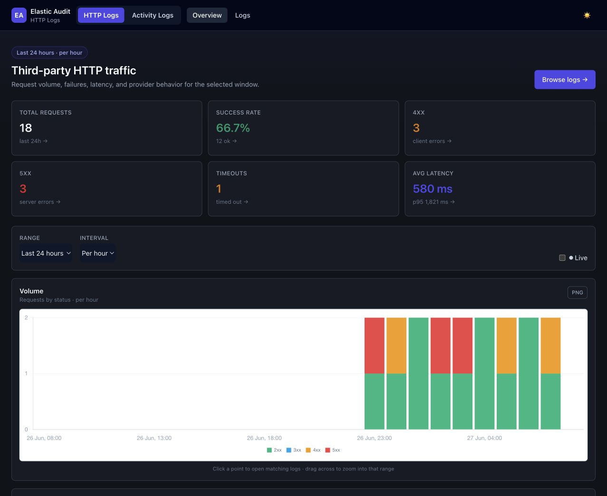
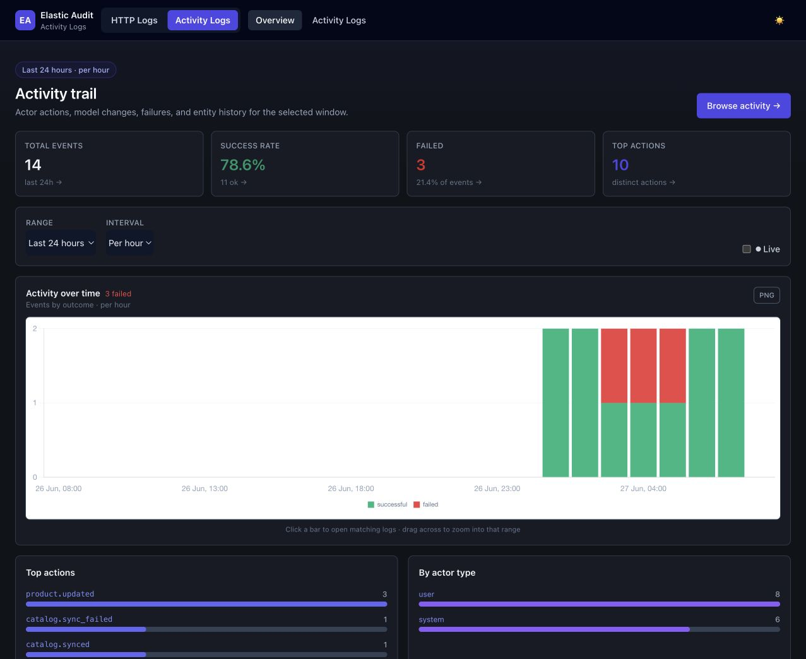

# Elastic Audit

Laravel package that logs third-party HTTP traffic and actor/model activity to a dedicated Elasticsearch cluster.

Elastic Audit is intended for internal applications that need a consistent audit/debug trail for provider calls,
callbacks, latency, status codes, entity context, sanitized payload previews, and domain activity. The package has two
independent subsystems that share one Elasticsearch connection:

- **Audit logs / HTTP logs** — outgoing third-party requests and incoming callbacks through the `HttpLog` facade and
  HTTP middleware.
- **Activity logs** — actor actions and Eloquent model changes through the `ActivityLog` facade and
  `ActivityLoggable` trait.

Each subsystem has its own config, Elasticsearch index/aliases, queue, console commands, and optional dashboard, so an
application can enable only what it needs.

## Guides

- [Audit Logs Guide](AUDIT_LOGS.md) — third-party HTTP request/callback logging, redaction, sampling, dashboards, and
  Elasticsearch queries.
- [Activity Logs Guide](ACTIVITY_LOGS.md) — actor/entity activity logging, automatic Eloquent change capture, and the
  activity dashboard.

## Screenshots





## Quick Start

1. Add the package repository to the consuming application's `composer.json`.
2. Install the package:

    ```bash
    composer require tsitsishvili/elastic-audit:^1.0
    ```

3. Publish config files and enum stubs:

    ```bash
    php artisan vendor:publish --tag=elastic-audit
    ```

4. Configure Elasticsearch and enable the subsystem you need in `.env`.
5. Create the Elasticsearch indices and aliases:

    ```bash
    php artisan http-logs:create-index
    php artisan activity-logs:create-index
    ```

6. Run a queue worker for the configured logs queue:

    ```bash
    php artisan queue:work --queue=default
    ```

## Requirements

- PHP `^8.2`
- Laravel `^12.0 || ^13.0`
- Elasticsearch PHP client `^8.5 || ^9.0`
- A queue worker, because logs are indexed through queued jobs

## Project Documents

- [Changelog](CHANGELOG.md)
- [Upgrade Guide](UPGRADE.md)
- [Contributing](CONTRIBUTING.md)
- [Coding Standards](CODING_STANDARDS.md)

## Internal Versioning

Use Git tags as Composer versions.

```bash
git tag v1.0.0
git push origin v1.0.0
```

Recommended policy:

- Patch: bug fixes only, for example `v1.0.1`
- Minor: backward-compatible features, for example `v1.1.0`
- Major: breaking config, contract, class, or behavior changes, for example `v2.0.0`

Applications should depend on stable tags:

```json
{
  "require": {
    "tsitsishvili/elastic-audit": "^1.0"
  }
}
```

Avoid using `dev-main` in production applications.
