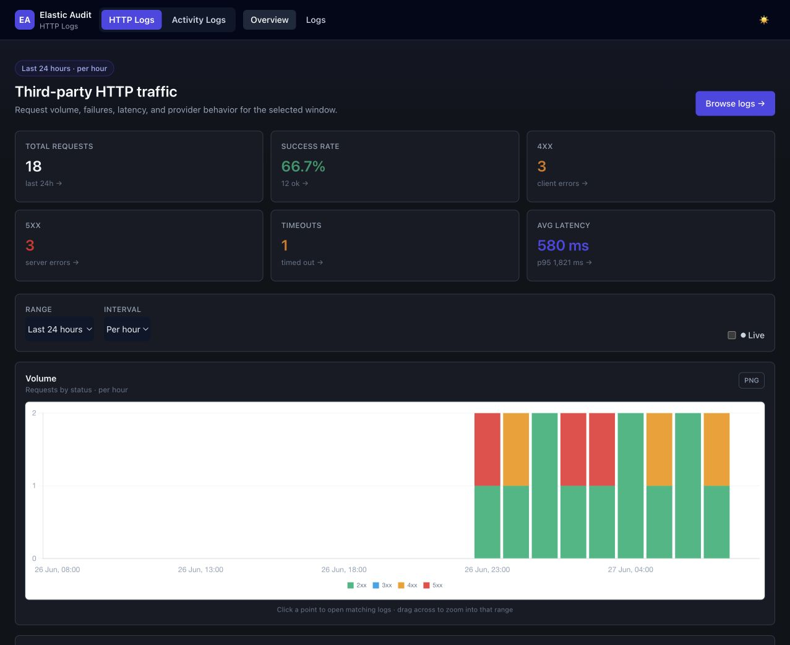
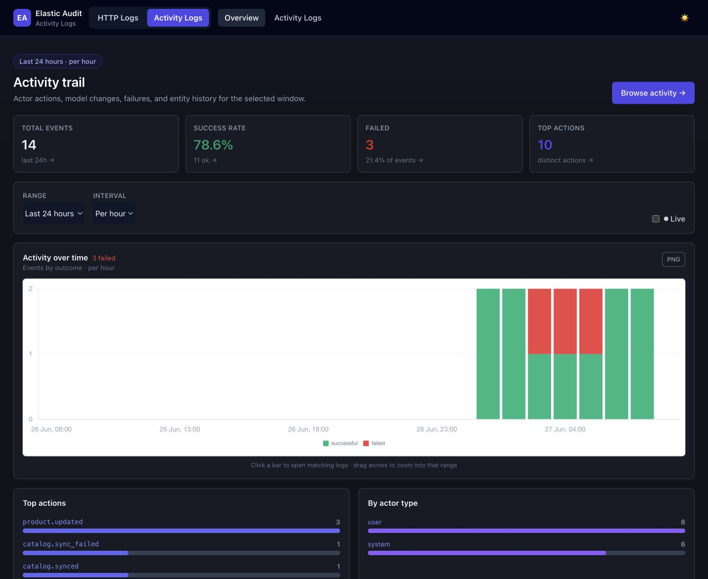

# Elastic Audit

Laravel package that logs third-party HTTP traffic and actor/model activity to a dedicated Elasticsearch cluster.

Elastic Audit is intended for internal applications that need a consistent audit/debug trail for provider calls,
callbacks, latency, status codes, entity context, sanitized payload previews, and domain activity. The package has two
independent subsystems that share one Elasticsearch connection:

- **Audit logs / HTTP logs** — outgoing third-party requests and incoming callbacks through the `HttpLog` facade and
  HTTP middleware.
- **Activity logs** — actor actions and Eloquent model changes through the `ActivityLog` facade and
  `ActivityLoggable` trait.

Each subsystem has its own config, Elasticsearch index/aliases, queue, console commands, and optional dashboard, so an
application can enable only what it needs.

## Guides

- [Audit Logs Guide](AUDIT_LOGS.md) — third-party HTTP request/callback logging, redaction, sampling, dashboards, and
  Elasticsearch queries.
  - [Installation](AUDIT_LOGS.md#installation) · [Configuration reference](AUDIT_LOGS.md#configuration-reference) ·
    [Logging outgoing requests](AUDIT_LOGS.md#logging-outgoing-requests) ·
    [Logging incoming callbacks](AUDIT_LOGS.md#logging-incoming-callbacks) · [Dashboard](AUDIT_LOGS.md#dashboard) ·
    [Troubleshooting](AUDIT_LOGS.md#troubleshooting)
- [Activity Logs Guide](ACTIVITY_LOGS.md) — actor/entity activity logging, automatic Eloquent change capture, and the
  activity dashboard.
  - [Configuration](ACTIVITY_LOGS.md#activity-configuration) · [Manual logging](ACTIVITY_LOGS.md#manual-logging) ·
    [Automatic model logging](ACTIVITY_LOGS.md#automatic-model-logging-the-activityloggable-trait) ·
    [Dashboard](ACTIVITY_LOGS.md#activity-dashboard)

## Screenshots





## Quick Start

1. Add the package repository to the consuming application's `composer.json`
   (see [Installation](AUDIT_LOGS.md#installation)).
2. Install the package:

    ```bash
    composer require tsitsishvili/elastic-audit
    ```

3. Publish config files, enum stubs, and dashboard assets (see [Publish Configuration](AUDIT_LOGS.md#publish-configuration)):

    ```bash
    php artisan vendor:publish --tag=elastic-audit
    ```

4. Configure Elasticsearch and enable the subsystem you need in `.env`
   (see [Environment Variables](AUDIT_LOGS.md#environment-variables) and
   [Register Application Enums](AUDIT_LOGS.md#register-application-enums)).
5. Install the lifecycle policy, then create the Elasticsearch indices and aliases
   ([HTTP](AUDIT_LOGS.md#create-elasticsearch-index) · [Activity](ACTIVITY_LOGS.md#create-the-activity-index)):

    ```bash
    php artisan elastic-audit:lifecycle-policy
    php artisan http-logs:create-index
    php artisan activity-logs:create-index
    ```

6. Run a queue worker for the configured logs queue (see [Queues](AUDIT_LOGS.md#queues)):

    ```bash
    php artisan queue:work --queue=default
    ```

For usage, see [logging outgoing requests](AUDIT_LOGS.md#logging-outgoing-requests),
[logging incoming callbacks](AUDIT_LOGS.md#logging-incoming-callbacks), and
[recording activity](ACTIVITY_LOGS.md#manual-logging).

## Requirements

- PHP `^8.2`
- Laravel `^12.0 || ^13.0`
- Elasticsearch PHP client `^8.5 || ^9.0`
- A queue worker, because logs are indexed through queued jobs

## Project Documents

- [Changelog](CHANGELOG.md)
- [Upgrade Guide](UPGRADE.md)
- [Contributing](CONTRIBUTING.md)
- [Coding Standards](CODING_STANDARDS.md)

## Internal Versioning

Use Git tags as Composer versions.

```bash
git tag v1.0.0
git push origin v1.0.0
```

Recommended policy:

- Patch: bug fixes only, for example `v1.0.1`
- Minor: backward-compatible features, for example `v1.1.0`
- Major: breaking config, contract, class, or behavior changes, for example `v2.0.0`

Applications should depend on stable tags:

```json
{
  "require": {
    "tsitsishvili/elastic-audit": "^3.0"
  }
}
```

Avoid using `dev-main` in production applications.
